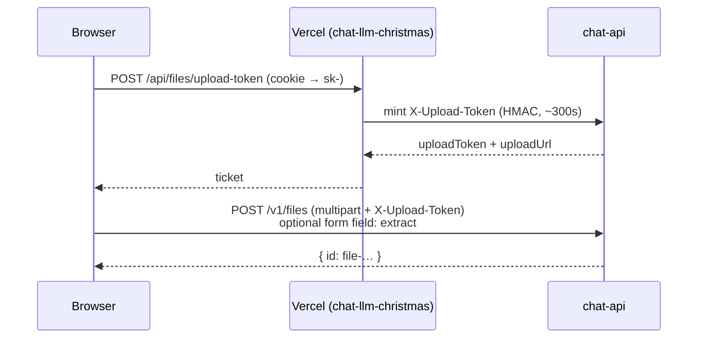
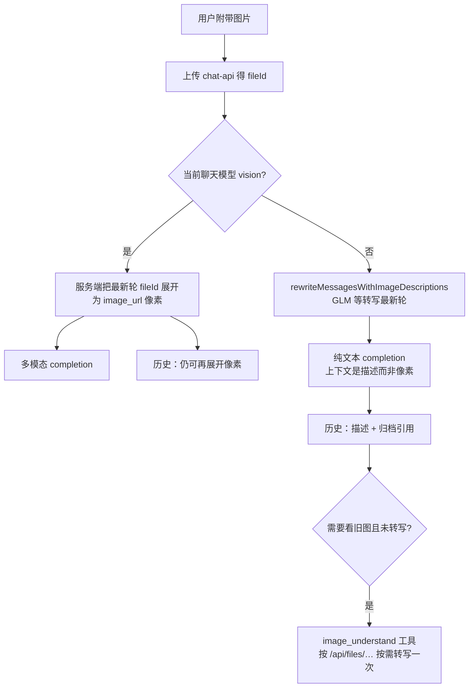
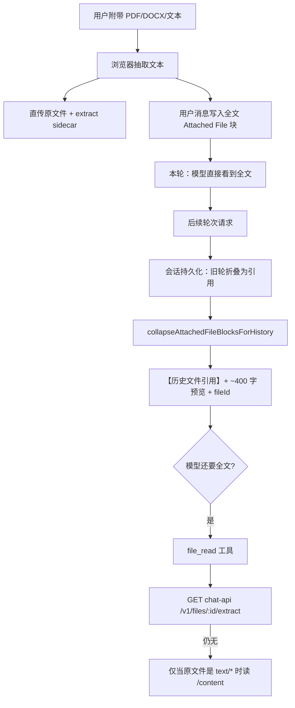

# 图片与文件附件：上传、上下文、工具

Christmas Chat 的附件链路跨两个仓库：

| 组件 | 仓库 | 职责 |
|------|------|------|
| 前端 + Next `/api/chat` | `chat-llm-christmas` | UI、客户端抽取、会话消息、工具执行、按模型组装上下文 |
| 文件存储 | `chat-api` | 磁盘存原文件 + 可选文本 extract sidecar；签发直传票 |

文档只描述**当前实现**，不写愿景。

---

## 1. 上传路径（绕过 Vercel 体积限制）

- **直传**：浏览器 → `api.chat.llm.christmas/v1/files`，不经过 Vercel body（约 4.5MB 限制）。
- **回退**：ticket 失败时仍走同源 `/api/files`（小文件 / 旧部署）。
- **图片**：原图直传（不压缩）；会话里主要存 `fileId`，预览走 `/api/files/<id>`。
- **PDF/DOCX/文本**：客户端抽取正文；上传原文件时附带 `extract` 字段；chat-api 写 `{path}.extract.txt` sidecar。
- 硬限制：chat-api `FILE_UPLOAD_MAX_BYTES`（默认 20MB）；客户端 `MAX_INGEST_BYTES` 同为 20MB；nginx 更大。

`UPLOAD_TOKEN_SECRET` 在 **chat-api** `.env`，不是前端密钥。前端只拿短时 ticket。

---

## 2. 会话里存什么？

| 类型 | 会话 JSON | 发给模型时 |
|------|-----------|------------|
| 图片 | `message.images[]`：`fileId` / url / 可选转写块 | 见 §3 |
| 文档 | 最新用户消息可含全文；更早轮次持久化为 `【历史文件引用】` + fileId | 见 §4 |

**不是**把像素/全文永久塞进「每次请求的工具结果历史」；源文件在 chat-api 磁盘，会话只持引用（+ 首轮全文或转写）。

---

## 3. 图片：视觉模型 vs 纯文本模型

要点：

- **视觉模型**：保留像素；**不要**走 `image_understand`（避免双计费）。
- **纯文本模型**：最新轮服务端自动转写（避免「首轮空转只调工具」）；更早未转写的图变成 `【历史图片引用（未转写）】` + 路径，模型可调 `image_understand`。
- **纯文本 → 视觉**：可从 archive / fileId **重新展开像素**（不是只能看描述）。
- `image_understand` **懒注入**：登录用户 + 会话有图 + 非视觉模型时才进工具列表（前端 `zhipu-vision` 集成开关会随有图自动打开）。

---

## 4. 文档：混合策略（首轮全文 + 历史引用 + file_read）

要点：

- **首轮不空转**：最新附件全文进用户消息；不要求模型先调工具再读。
- **会话也折叠**：下一轮发送时，旧用户消息里的全文（有 fileId）被压成引用；云同步 / 本地恢复同样处理。最新用户轮保留全文，方便 Retry。
- **气泡不泄全文**：UI 展示用 `attachedFilesForUserBubbleDisplay`，即使本轮会话里还存着全文也不刷屏。
- **`file_read` 懒注入**：本线程有附件文档时才进工具列表。
- **重读靠 sidecar**：不再每轮把 `fileExtracts` 塞进 `/api/chat` body；`file_read` 读 chat-api `GET /v1/files/:id/extract`。

---

## 5. 工具跑在哪？

- **执行位置**：`chat-llm-christmas` 的 Next `/api/chat`（服务端），不是浏览器，也不是 chat-api。
- **chat-api**：存文件、直传鉴权、可选 extract；不做 chat tool loop。
- **UI**：可选工具（paper/book/generate_image）默认关；内置常开收在 Tools 折叠里；`file_read` / Image Understand 显示为「有附件/有图时自动」。

---

## 6. 与主流产品的对应关系（简记）

ChatGPT / Claude / Gemini 常见模式：上传后服务端持有资产 id，上下文用引用 + 按模型能力注入；长文档不会每轮全文重放。本项目的混合策略同一思路：**最新轮完整，历史引用，按需工具重读**；视觉模型额外保留像素路径。

---

## 7. 相关代码入口

| 主题 | 路径 |
|------|------|
| 直传 | `lib/files/direct-upload.ts`，chat-api `routes/files.js` + `uploadToken.js` |
| 抽取 / 直传准备 | `lib/files/ingest/*` |
| 历史折叠 | `lib/files/attached-file-blocks.ts` |
| 视觉组装 / 转写 | `lib/chat/server/chat-request.ts`，`lib/tools/image-understand/*` |
| file_read | `lib/tools/file-read/tool.ts` |
| 产品说明（注入模型） | `lib/chat/server/product-guide.ts` |
