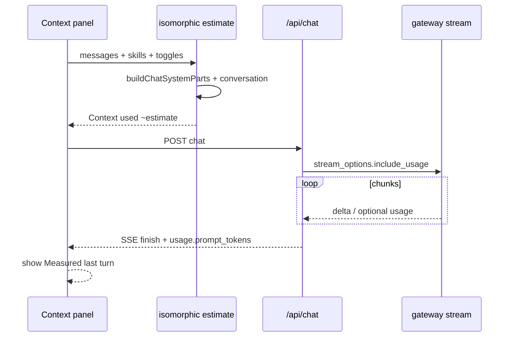

# feat: Accurate context tokens (isomorphic estimate + usage)

## Goal Capsule

Make the Context panel’s token numbers match reality as closely as practical:

1. **Before send** — estimate from the **same system assembly** the server uses (plus conversation / files / images), so System is no longer ~40 while the real prompt is 1k+.
2. **After a turn** — show **gateway-reported** `prompt_tokens` / `completion_tokens` for the final completion when available.

**Stop when:** panel shows isomorphic estimate + last-turn measured usage (with clear labels); compact gate uses the improved estimate; missing gateway usage degrades cleanly.

**Authority:** product intent from this thread (session-settled: user chose both isomorphic estimate **and** measured usage over estimate-only or usage-only).

---

## Product Contract

### Problem Frame

Context used ≈128 with System≈40 looked “empty” because the UI only tokenized `DEFAULT_SYSTEM_PROMPT`, while `/api/chat` injects product guide, capabilities, tools guidance, memories, etc. Separately, users expect “actual” counts; the only cross-model ground truth is upstream `usage` — which this codebase never reads or forwards.

### Requirements

- **R1.** Pre-send / live Context estimate’s **System** (and related injected text) must be derived from the same parts as `buildChatSystemParts` (best-effort client mirror of opts), not only the editable system textarea.
- **R2.** Compact / refuse gates (`estimateTokensForSend`) must use that improved system estimate so thresholds are not falsely soft.
- **R3.** After a successful (or finished) chat turn, if the gateway returns usage on the **final** completion stream, surface `prompt_tokens` (and optionally `completion_tokens`) in the Context panel as **measured last turn**.
- **R4.** UI must label estimate vs measured so users don’t confuse window occupancy with cumulative billing.
- **R5.** If `include_usage` / usage chunks are unsupported, keep estimate-only; never break the stream.
- **R6.** Out of scope: model-specific tokenizers (tiktoken per vendor), summing every tool-round usage into one number, billing dashboards.

### Key Decisions (product)

- Context progress bar continues to mean **estimated current window occupancy** (system once + history once), not system×turns.
- Measured usage is **last final completion’s input size**, not lifetime spend.

### Actors / Flows

- **A1 User** glances at Context while chatting; may compact near limit.
- **F1** Idle panel: isomorphic estimate updates as messages/skills/toggles change.
- **F2** Send: compact gate uses isomorphic estimate.
- **F3** Stream ends: optional measured usage appears under Context used.

### Acceptance Examples

- **AE1.** Empty custom system prompt → System estimate ≫ 40 (includes capabilities + product guide + time context at minimum).
- **AE2.** With gateway usage: after a reply, panel shows last-turn `prompt_tokens` near the isomorphic total order of magnitude (not exact match required).
- **AE3.** Gateway without usage: stream still completes; panel shows estimate only; no console-fatal errors.

---

## Planning Contract

### Key Technical Decisions

| ID | Decision | Rationale |
|----|----------|-----------|
| **KTD1** (session-settled: user-directed — chosen over estimate-only / usage-only) | Ship **both** isomorphic pre-send estimate and post-turn measured usage | User selected option 1; estimate fixes compact; usage fixes trust. |
| **KTD2** | Extract pure `buildChatSystemParts` / join helpers to a **client-safe** module (e.g. `lib/chat/prompt/system-parts.ts`); `lib/chat/server/system-prompt.ts` re-exports | `docs/code-organization.md`: do not import `lib/chat/server/*` from client. |
| **KTD3** | Client estimate uses **best-effort opts** (active skills, memories flag, integrations, tool guidance string if already available client-side, reference text, autoReview). Accept small drift vs server for catalogs fetched only server-side | Perfect parity needs duplicating full tool resolution; not worth blocking. |
| **KTD4** | Request usage via OpenAI-compatible `stream_options: { include_usage: true }` on streams that matter; collect `chunk.usage` in upstream loop; attach to **final** `streamCompletionPayload` (or sibling SSE field `usage`) | Standard pattern; many gateways emit usage on the last SSE chunk. |
| **KTD5** | Measured usage = **final answer completion only** (post tool rounds). Do not sum planner/tool rounds into the panel primary number | Avoids ambiguous “which prompt?”; matches what the user just saw answered. |
| **KTD6** | Keep `estimateTokensFromText` heuristic for estimate path; do **not** add per-model tokenizers in this PR | Cross-model truth is usage; heuristic is enough for compact. |

### High-Level Technical Design

### Assumptions

- Gateway for primary models accepts `stream_options.include_usage` or ignores unknown fields safely.
- When usage is missing, estimate remains the sole number (R5).

### Deferred to Follow-Up Work

- Per-tool-round usage breakdown in Process UI.
- Exact client mirror of every server-only catalog string.
- Persist measured usage into session JSON for history scrubbing analytics.

---

## Implementation Units

### U1. Client-safe system-parts module + isomorphic estimate

**Goal:** System bucket reflects server assembly; compact uses it.

**Requirements:** R1, R2, R4 (estimate side)

**Dependencies:** none

**Files:**
- create `lib/chat/prompt/system-parts.ts` (move/adapt from `lib/chat/server/system-prompt.ts`)
- modify `lib/chat/server/system-prompt.ts` (thin re-export / wrap)
- create `lib/chat/turn/context-estimate.ts` (build breakdown from client-visible state)
- modify `lib/chat/turn/send-estimate.ts`
- modify `components/chat-container.tsx` (wire estimate; remove misleading “aligned” comment or make it true)
- modify `hooks/chat/use-logic.ts` if it only passes `{ system, skills }`
- tests: `tests/chat/turn/context-estimate.test.ts`, update `tests/chat/turn-helpers.test.ts`, `tests/chat/server/system-prompt.test.ts`

**Approach:**
1. Move pure string assembly out of `server/` so client can import.
2. Add `estimateContextBreakdown(opts)` returning `{ system, skills, reference, files, images, conversation, total, source: 'estimate' }`.
3. System tokens = `estimateTokensFromText(joinChatSystemParts(buildChatSystemParts(mirroredOpts)))` (skills already inside parts — avoid double-counting; either fold skills into system line or keep Skills row as subset labeled clearly).
4. Prefer: **System row = full joined parts**; Skills row optional/zero if already inside parts, or keep Skills as detail only without adding twice to total.
5. Feed `estimateTokensForSend` from the new total/system fields.

**Patterns:** Existing `buildChatSystemParts`; `estimateTokensFromText` in `lib/models/specs/tokens.ts`.

**Test scenarios:**
- Happy: empty custom prompt → system estimate ≥ capabilities+product+default magnitude (e.g. > 500 with heuristic).
- Edge: `expandProductGuide` true increases estimate vs false.
- No double-count: total ≠ system + skills when skills already in parts.
- Compact input: `estimateTokensForSend` rises when product guide is included vs old DEFAULT-only baseline.
- Server re-export: existing system-prompt tests still pass.

**Verification:** Unit tests green; manually open Context panel on empty thread and see System ≫ 40.

---

### U2. Upstream usage capture + SSE finish payload

**Goal:** Final completion can report measured tokens to the client.

**Requirements:** R3, R5

**Dependencies:** none (can parallel U1)

**Files:**
- modify `lib/chat/server/upstream.ts` (optional helper to merge `stream_options`; yield/pass usage)
- modify `lib/chat/server/final-completion.ts` (request include_usage; return `usage`)
- modify `lib/chat/stream/truncation.ts` (`streamCompletionPayload` optional usage fields)
- modify `lib/chat/server/chat-request.ts` (attach usage on final send)
- optionally `lib/chat/server/tool-round.ts` / `plain-completion.ts` — only if easy; primary is final
- tests: `tests/chat/stream/truncation.test.ts` (or new), `tests/chat/server/final-completion` / upstream mock if present

**Approach:**
1. Add `stream_options: { include_usage: true }` to final (and optionally tool-round) body.
2. While iterating chunks, if `chunk.usage` present, keep latest `{ prompt_tokens, completion_tokens, total_tokens }`.
3. Extend finish payload: `usage?: { prompt_tokens?, completion_tokens?, total_tokens? }`.
4. Swallow gateway rejection of `stream_options` (retry without, like `enable_thinking`).

**Test scenarios:**
- Payload includes usage when provided to `streamCompletionPayload`.
- Missing usage → payload omit field / undefined.
- Upstream mock last chunk with usage → `streamFinalCompletion` result carries it.
- Unsupported stream_options → still streams content (retry path).

**Verification:** Integration or mocked stream test; optional live gateway smoke.

---

### U3. Client parse usage + Context panel UI

**Goal:** Show measured last-turn tokens beside estimate.

**Requirements:** R3, R4, R5

**Dependencies:** U1 (labels), U2 (SSE field)

**Files:**
- modify `lib/chat/stream/client.ts` (parse `usage` on finish event)
- modify `hooks/chat/use-logic.ts` or session state holder for `lastTurnUsage`
- modify `components/chat/panels/ChatContextPanel.tsx`
- modify `components/chat-container.tsx` props
- tests: stream client parse test if exists; panel unit optional

**Approach:**
1. On finish SSE, store `lastTurnUsage` in hook/session (ephemeral is enough for v1).
2. Panel: keep `Context used ~estimate / usableLimit`; add line `Measured last turn: N prompt (M completion)` when present.
3. Copy: short footnote that estimate is for compact/window; measured is gateway billing input for the final answer call.

**Test scenarios:**
- Client parses finish JSON with usage into callback/state.
- Panel hides measured row when null.
- Estimate still renders when measured present (both visible).

**Verification:** Manual chat turn; Network/SSE or UI shows measured when gateway cooperates.

---

## Verification Contract

- `npm test` (focus: turn estimate, system-prompt, stream truncation, stream client).
- Manual: Context System ≫ 40; after turn, measured appears or degrades silently.
- Confirm compact still triggers near 90% usable with larger system estimate (may compact earlier — expected).

---

## Definition of Done

- [ ] U1 isomorphic estimate live; no client→`server/` imports.
- [ ] U2 usage on final finish when gateway provides it.
- [ ] U3 panel labels estimate vs measured.
- [ ] Tests for AE1–AE3 style cases.
- [ ] No stream regressions when usage unsupported.

---

## Risks & Mitigation

| Risk | Mitigation |
|------|------------|
| Gateway ignores/rejects `stream_options` | Retry without; R5 |
| Estimate still ≠ prompt_tokens (tools schema, vision) | Label as estimate; measured corrects after turn |
| Earlier compact | Intentional; document in panel tip if needed |
| Double-counting skills | Single ownership in total (KTD in U1 approach) |

---

## Sources & Research

- Repo research: SSE path `app/api/chat/route.ts` → `chat-request.ts` → `streamChatResponse`; no existing `prompt_tokens` plumbing.
- `buildChatSystemParts` in `lib/chat/server/system-prompt.ts`; UI underestimate in `components/chat-container.tsx` `contextBreakdown`.
- Session decision: plan both isomorphic + measured usage.
