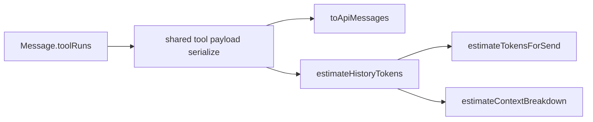

# fix: Count tool result bodies in context estimates

## Goal Capsule

Close the undercount where Context / compact estimates tokenize only `messagePlainText` (content + reasoning) while the real send path expands done `toolRuns` into tool_calls + tool JSON — including `results[].body` as `content` (capped 8 results / 240 snippet / 16_000 body).

**Stop when:** `estimateTokensForSend` and `estimateContextBreakdown.conversation` count the same tool receipt payload shape as `toApiMessages`; tests lock caps and exclusions; display `messagePlainText` stays display-only.

**Authority:** session-settled — user chose full API fidelity (including OCR / `image_understand` double-count when both user injection and tool receipt exist), over estimate-side de-duplication.

---

## Product Contract

### Problem Frame

After isomorphic system estimate landed, history can still look “cheap” when prior turns ran web_search / research / OCR with large `results[].body`. Compact may stay soft and the Context panel’s Conversation bucket misleads until measured usage appears.

### Requirements

- R1. Pre-send and live Context **conversation / history** token estimates must include API-replayed tool receipts for done, non–`claim_reviewer` runs — same payload fields and caps as `toApiMessages`.
- R2. Do **not** change `messagePlainText` semantics (visible answer + thinking for UI / rollback display).
- R3. Caps stay shared: at most 8 results; snippet ≤ 240 chars; body → `content` ≤ 16_000 chars; error payloads match the API serializer.
- R4. Fidelity over “effective unique text”: if the live API can double-count OCR injection + tool receipt, the estimate does too.
- R5. Out of scope: per-model tokenizers; summing multi-round gateway usage; fixing reasoning-in-estimate vs reasoning-not-in-API drift; interrupt/queue races.

### Key Decisions (product)

- Compact and Context remain **window occupancy estimates**, not billing.
- Prefer matching what `/api/chat` actually sends over a prettier unique-information number.

### Actors / Flows

- A1 User — glances at Context; may compact near limit after tool-heavy turns.
- F1 Idle panel — conversation bucket rises when history holds large tool bodies.
- F2 Send / edit-resend — projected tokens include tool receipts on the truncated history.

### Acceptance Examples

- AE1. Assistant with one done `web_search` run and a 10k-char `results[0].body` → estimate conversation tokens ≫ plain content-only estimate (body contribution ≈ capped serialize).
- AE2. `claim_reviewer` or non-`done` runs → no tool JSON added to the estimate.
- AE3. Nine results → only first eight counted; body longer than 16_000 → only 16_000 chars enter the JSON string counted.

---

## Planning Contract

### Key Technical Decisions

| ID | Decision | Rationale |
|----|----------|-----------|
| **KTD1** (session-settled: user-directed — chosen over OCR de-dupe) | Match `toApiMessages` tool expansion byte-for-byte for estimate inputs, including possible OCR double-count | User selected option 1; compact must not under-trigger vs real prompt. |
| **KTD2** | Extract a shared pure helper for the done-run tool JSON payload (and keep filter: `name` present, not `claim_reviewer`, `status === 'done'`) used by both `toApiMessages` and the estimator | Single source of truth for 8 / 240 / 16_000 and error shape. |
| **KTD3** | Add `estimateHistoryTokens(messages)` (name flexible) that, per message: counts estimate text for the user/assistant **answer path** plus tool_calls + tool `content` strings when runs expand — used by `send-estimate` and `context-estimate` | Avoid duplicating reduce loops; do not overload `messagePlainText`. |
| **KTD4** | Leave `messagePlainText` unchanged | Display / export / latest-user-ask helpers must not suddenly include JSON tool dumps. |
| **KTD5** | Defer collapsing history file blocks / vision strip parity into a follow-up unless cheap while touching the helper | This fix targets tool body undercount; full `toApiMessages` isomorphic history is larger. |

### High-Level Technical Design

Directional guidance (not implementation spec): for each assistant with expandable runs, estimate tokens of (1) serialized `tool_calls` arguments, (2) each `JSON.stringify(payload)` tool message, (3) the follow-up assistant answer text (content + existing reviewFix / file-ref append if already mirrored — or content-only if file-ref parity stays deferred under KTD5). User messages keep the current plain-text (+ images flat fee) path.

### Assumptions

- Shared serialize must stay client-safe (no Node-only imports) because estimates run in the browser.
- `estimateTokensFromText` remains the heuristic; only the **input string** set expands.

### Scope Boundaries

#### In scope

- Shared tool receipt payload helper + history estimate wiring for send + context.
- Tests for caps, exclusions, and large body contribution.

#### Out of scope / Deferred to Follow-Up Work

- Full isomorphic history (collapse attached-file blocks, vision OCR strip variants, assistant file-ref append if not already covered cheaply).
- Dropping reasoning from estimates to match API (today estimate includes reasoning via `messagePlainText`; API uses `content` only).
- Interrupt + 50ms queue race from prior review.

---

## Implementation Units

### U1. Shared tool-receipt serialize + history estimate

**Goal:** One pure module owns done-run filtering and the tool JSON payload; a history estimator counts those strings plus message answer text without changing `messagePlainText`.

**Requirements:** R1, R2, R3, R4 — KTD1–KTD4

**Dependencies:** none

**Files:**
- Create or extend under `lib/chat/message/` (e.g. tool-receipt serialize next to `api-messages.ts`)
- Modify `lib/chat/message/api-messages.ts` to call the shared helper
- Create `lib/chat/turn/history-estimate.ts` (or colocated export) with `estimateHistoryTokens`
- Test: `tests/chat/turn/history-estimate.test.ts` (and/or extend `tests/chat/message/api-messages-*.test.ts` for payload parity)

**Approach:**
1. Lift the payload object construction currently inline in `toApiMessages` (ok/error, query, provider, results map with content from body).
2. Have `toApiMessages` use that helper for tool message `content`.
3. Implement `estimateHistoryTokens` to walk messages: base text via existing plain-text helper for non-expanded paths; for expandable assistants add tokens for tool_calls + tool JSONs + answer content (avoid double-counting the same answer string).
4. Keep claim_reviewer / non-done out of both API and estimate.

**Execution note:** Prefer a characterization-style test that builds a Message with a large `body`, asserts estimate delta vs content-only, and asserts `JSON.stringify(sharedPayload)` matches what `toApiMessages` would put on the tool role.

**Patterns to follow:** Caps and filter already in `lib/chat/message/api-messages.ts`; token helper `estimateTokensFromText` in `lib/models/specs`.

**Test scenarios:**
- Happy path: one done search run with body → estimate includes ≈ `estimateTokensFromText(JSON.stringify(payload))` (+ tool_calls overhead).
- Edge: empty results / no body → still counts ok/query JSON, no content field.
- Edge: 9 results → only 8 in payload; snippet > 240 truncated; body > 16_000 truncated.
- Error path: `r.error` set → `{ ok: false, error, query? }` counted; no results.
- Exclusion: `claim_reviewer` done run → estimate equals content-only path for tools.
- Exclusion: `status: 'start'` → not counted.
- Integration: shared payload string equals tool `content` from `toApiMessages` for the same message.

**Verification:** Unit tests green; `toApiMessages` behavior unchanged for existing file-ref tests.

---

### U2. Wire send + context estimates

**Goal:** Compact gate and Context panel conversation bucket use `estimateHistoryTokens`.

**Requirements:** R1, F1, F2 — AE1

**Dependencies:** U1

**Files:**
- Modify `lib/chat/turn/send-estimate.ts`
- Modify `lib/chat/turn/context-estimate.ts`
- Modify `tests/chat/turn/context-estimate.test.ts` and/or `tests/chat/turn-helpers.test.ts`

**Approach:**
1. Replace the `messagePlainText` reduce in both estimators’ history/conversation path with `estimateHistoryTokens`.
2. Keep image flat fees (1000 × count) as today.
3. Do not change system / skills / files / measured-usage paths.

**Patterns to follow:** Existing isomorphic estimate plan wiring in `docs/plans/2026-08-06-001-feat-context-token-usage-plan.md`.

**Test scenarios:**
- Happy path: `estimateContextBreakdown.conversation` increases when messages gain a large tool body (system unchanged).
- Happy path: `estimateTokensForSend` with tool-heavy history exceeds the old content-only projection for the same inputs.
- Integration: truncate-style history (edit/resend prior slice) still only counts tools on remaining messages.

**Verification:** Existing context-estimate system tests still pass; new assertions cover tool-body uplift.

---

## Verification Contract

- Run targeted vitest for history / context / send estimate and api-messages file-ref suites.
- Manual smoke (optional): after a web_search or research turn with long bodies, Context Conversation / total jumps before the next send; compact threshold more likely to fire on long tool threads.

## Definition of Done

- Shared serialize used by API path and estimate path.
- Send + context history estimates include tool receipt JSON under R3 caps.
- `messagePlainText` unchanged.
- Tests cover AE1–AE3 class scenarios.
- No intentional OCR de-dupe (KTD1).

## Sources & Research

- Gap called out in prior context-token review residual: tool result bodies not counted.
- Ground truth: `lib/chat/message/api-messages.ts` tool expansion; estimate paths in `lib/chat/turn/send-estimate.ts`, `lib/chat/turn/context-estimate.ts`.
- Prior plan: `docs/plans/2026-08-06-001-feat-context-token-usage-plan.md` (system isomorphic; this plan closes history tool gap).
- External research: skipped — local serializer is the contract.
