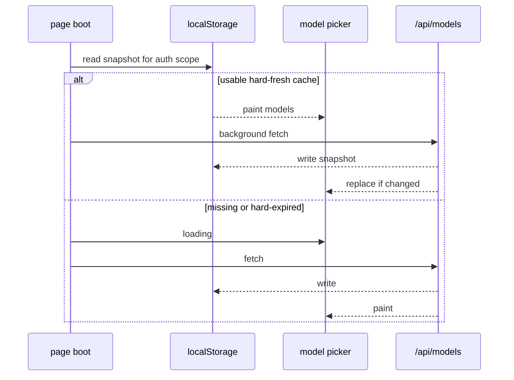

# feat: Cache model list in localStorage with SWR refresh

## Goal Capsule

Make return visits to the chat page show the model picker immediately from a browser snapshot, while still refreshing from `/api/models` in the background so the list stays eventually consistent with the main site.

**Stop when:** cached list paints before network; soft 1h / hard 7d TTL; auth-scope mismatch or login/logout invalidates cache; network failure with hard-fresh cache still shows models; `messagePlainText`/catalog sync unrelated work stays out.

**Authority:** session-settled — Local Storage + background refresh (not Cookie); soft 1h / hard 7d defaults from the agreed scheme.

**Product Contract preservation:** n/a (ce-plan-bootstrap).

---

## Product Contract

### Problem Frame

Every page load waits on `/api/models` → upstream `GET /v1/models` (+ pricing). Local `SPECS` fills context instantly, but the **id list** is network-bound. Users see a long “loading models” state on every revisit even when yesterday’s list would be fine.

### Requirements

- R1. On mount, if a usable localStorage snapshot exists for the current auth scope, populate `availableModels` (and keep a valid `selectedModel` if still in the list) **before** waiting on the network.
- R2. Always kick a background `/api/models` refresh (SWR); on success, replace state and rewrite the snapshot.
- R3. Soft TTL **1 hour**: snapshot still shown; refresh always runs. Hard TTL **7 days**: treat as unusable — show loading until network (or empty/error path as today).
- R4. Snapshot must be keyed (or tagged) by **auth visibility** (`authed` / free-only vs full list). Guest cache must not flash Pro models after logout; bound cache must not stick after disconnect.
- R5. Login bind / disconnect must clear or overwrite cache and force a fetch (existing call sites).
- R6. Out of scope: Cookie storage; bundling the full catalog into the JS bundle; changing Edge server `CATALOG_TTL_MS`; fixing unknown `?` context for new model ids (separate catalog update).

### Key Decisions (product)

- Prefer **fast stale UI** over waiting for perfect freshness; a briefly missing/retired model id fails at send time (acceptable).
- No “updating…” chrome required for MVP — silent refresh when cache hit; spinner only when there is no usable cache.

### Actors / Flows

- A1 Returning user — opens site, model menu usable immediately.
- F1 Cold first visit — no cache → current loading behavior.
- F2 Warm visit within 7d — cache paint + background refresh.
- F3 Login / logout — invalidate prior scope; fetch correct free/full list.

### Acceptance Examples

- AE1. With a valid guest snapshot, reload shows models without waiting for network; network later updates the list if ids changed.
- AE2. Snapshot older than 7 days does not paint; loading shows until `/api/models` returns.
- AE3. After disconnect, Pro-only entries from a bound snapshot do not remain visible.

### Summary

LocalStorage SWR for `/api/models` visibility list: instant paint from cache, background refresh, auth-scoped invalidation, 1h soft / 7d hard TTL.

---

## Planning Contract

### Key Technical Decisions

| ID | Decision | Rationale |
|----|----------|-----------|
| **KTD1** (session-settled: user-approved — chosen over Cookie / server-TTL-only) | Store snapshot in `localStorage`, not Cookie | Size + no request bloat; matches locale/theme/session prefs pattern. |
| **KTD2** (session-settled: user-approved — chosen over cache-only without refresh) | Always revalidate in background after paint | Keeps list eventually consistent with main site. |
| **KTD3** (session-settled: user-approved — chosen over unspecified TTLs) | Soft **1h** / hard **7d** | Agreed defaults; soft only affects “should we bother showing age metadata,” hard gates paint. Refresh runs whenever paint uses soft-or-hard-fresh cache **and** on every mount. |
| **KTD4** | Cache payload includes `{ v, at, authed, models }` with a small schema version; ignore unknown/corrupt JSON | Safe evolve; `authed` matches `/api/models` `authed` flag for free vs full list. |
| **KTD5** | Extract pure read/write/clear helpers under `lib/models/` (client-safe); keep orchestration in `fetchModels` / boot | Test without mounting chat-container; mirror `lib/memories/prefs.ts` try/catch style. |
| **KTD6** | `modelsLoading === true` only when no usable snapshot to show; cache hit → `false` immediately while refresh runs | Removes the long spinner on warm loads. |

### High-Level Technical Design

### Assumptions

- Auth scope for first paint can use the same bound flag boot already resolves (`refreshAccountStatus` then hydrate) **or** a stored `authed` on the snapshot checked after account status returns — implementer should not paint a mismatched scope. Prefer: wait until `bound` is known (status call is usually fast) then read LS keyed by that flag; if status is slow, still better than wrong Pro list. Deferred exact ordering if status already gates `fetchModels` today (it does — models fetch runs after status).
- Quota / private-mode LS failures degrade to current network-only path.

### Scope Boundaries

#### In scope

- Client snapshot module + wire into `fetchModels` / bind / disconnect.
- Unit tests for TTL, auth mismatch, corrupt payload.

#### Deferred to Follow-Up Work

- Longer Edge `CATALOG_TTL_MS` / CDN caching of `/api/models`.
- Filling `catalog.ts` for new ids like `kimi-k3-5d` (`?` context).
- Visible “refreshing models” indicator.

---

## Implementation Units

### U1. Model list localStorage helpers

**Goal:** Pure client helpers to read/write/clear a versioned models snapshot with soft/hard TTL and auth tag.

**Requirements:** R3, R4, R6 — KTD3–KTD5

**Dependencies:** none

**Files:**
- Create `lib/models/models-cache.ts` (name flexible)
- Test: `tests/models/models-cache.test.ts`

**Approach:**
1. Define storage key under `llm_christmas_*` convention and payload shape `{ v, at, authed, models }`.
2. `readModelsCache({ authed })` — return models only if `authed` matches and `now - at < HARD_TTL_MS`; else null.
3. `writeModelsCache({ authed, models })` — set `at = Date.now()`.
4. `clearModelsCache()` for logout / bind transitions.
5. Export soft/hard constants (1h / 7d). Soft TTL may be unused for paint gating but available if UI later wants a subtle stale hint; hard gates paint.

**Patterns to follow:** `lib/memories/prefs.ts` try/catch ignore; `lib/chat/session/persist.ts` JSON parse resilience.

**Test scenarios:**
- Happy: write then read with matching `authed` returns models.
- Edge: mismatched `authed` → null.
- Edge: `at` older than 7d → null.
- Edge: corrupt JSON / wrong `v` → null without throw.
- Error: `localStorage` throw → read returns null; write no-ops.

**Verification:** Unit tests green in isolation.

---

### U2. Wire SWR into fetchModels and auth transitions

**Goal:** Warm boots paint from cache; background fetch updates; auth changes clear/refetch; loading spinner only without usable cache.

**Requirements:** R1, R2, R5 — F1–F3, AE1–AE3 — KTD1, KTD2, KTD6

**Dependencies:** U1

**Files:**
- Modify `components/chat-container.tsx` (`fetchModels`, `saveUserKey` / `disconnectAccount` as needed)
- Optionally thin test of pure apply helpers if extracted; otherwise rely on U1 + manual smoke

**Approach:**
1. At start of `fetchModels`, after auth scope is known: if `readModelsCache` hits, `setAvailableModels` + resolve `selectedModel` (same rules as today) and set `modelsLoading` false; still continue network fetch.
2. On successful network response: `setAvailableModels`, write cache with response `authed`, then clear loading.
3. On network failure: if cache already painted, leave it; if not, keep empty/error behavior.
4. On bind success and disconnect: `clearModelsCache()` then fetch (or write only after successful fetch with new `authed`).
5. Do not change `/api/models` server route in this unit.

**Execution note:** Prefer extracting a small pure `applyModelsResponse(models, selectedModel)` for selected-id resolution if it keeps the container thinner — optional.

**Patterns to follow:** Existing `fetchModels` selected-model resolution and `llm_christmas_selected_model` key.

**Test scenarios:**
- Happy: with seeded LS + mock fetch slower than paint path — document via unit on helpers; manual AE1.
- Integration: disconnect clears cache key (unit asserting `clear` then read null).
- Error: fetch rejects after cache paint — models remain from cache.

**Verification:** Manual warm reload feels instant; logout no longer shows Pro list from old cache; first visit still loads via network.

---

## Verification Contract

- Vitest: `tests/models/models-cache.test.ts` (and any new helpers).
- Manual: warm reload → picker populated before network finishes; DevTools Application → Local Storage shows snapshot; logout → free-only list after refresh.

## Definition of Done

- Warm revisit paints from LS without blocking spinner.
- Background refresh updates list and LS.
- Hard-expired / missing / auth-mismatched cache does not paint wrong list.
- Bind/disconnect invalidate correctly.
- Agreed TTLs and no Cookie path.

## Sources & Research

- Current boot: `components/chat-container.tsx` `fetchModels` + mount effect (`cache: 'no-store'`).
- Server list source: `app/api/models/route.ts` (upstream models + local `getModelSpec`).
- External research: skipped — local storage patterns already in-repo.
