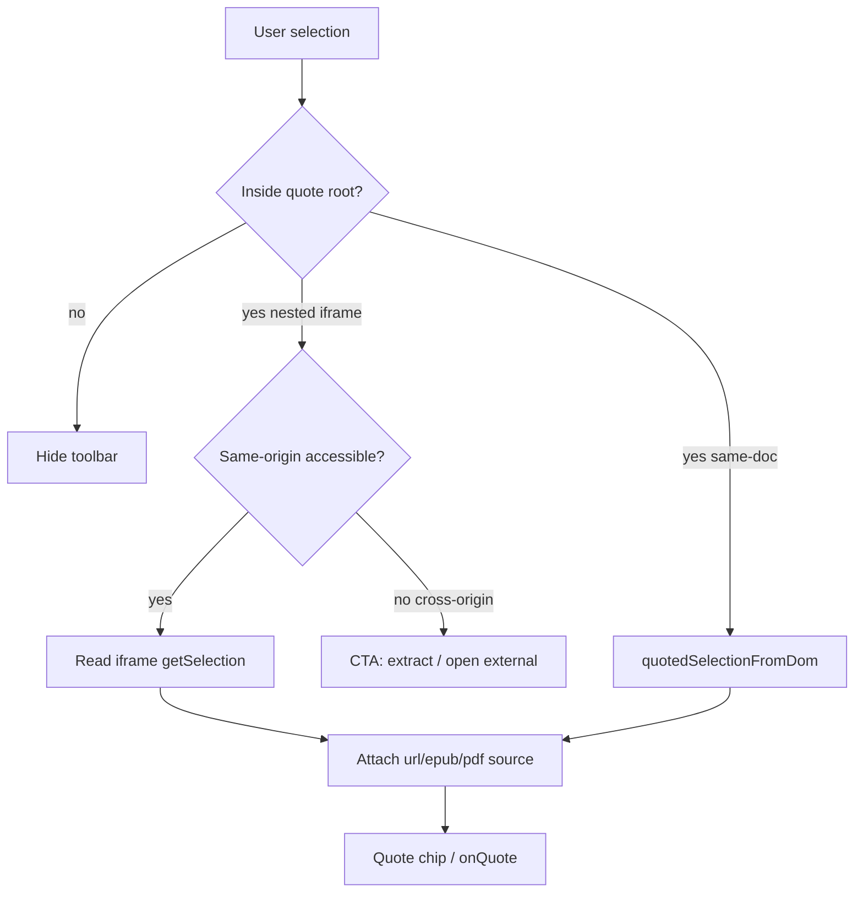

# feat: Strengthen Quote for URL extract and same-origin iframe (EPUB)

## Goal Capsule

Extend the shared Chat Quote pipeline so URL **extract** quotes carry page identity (URL/title + optional neighbors), cross-origin **iframe** preview honestly degrades to extract/open-external, and **same-origin** iframe surfaces (primarily EPUB via epubjs) can Quote like PDF text layers.

**Stop when:** extract URL quotes encode url/title; cross-origin embed shows a clear Quote-unavailable path; EPUB same-origin selection produces a Quote chip with file + locator metadata; unit tests cover metadata encoding and same-origin selection bridging; no cookie-proxy or cross-origin selection hack ships.

**Authority:** session-settled — user chose “全力推进含 iframe” then confirmed option **1**: research + product degrade for cross-origin URL iframes; real bridging only for same-origin (EPUB / controllable embeds). ToolView + fullscreen Overlay Quote wiring already shipped (PR #26) and is out of this plan.

---

## Product Contract

### Summary

Quote stays one shared system (`ChatQuoteToolbar` + `quotedSelectionFromDom` / encoders). This plan fills the remaining Preview gaps that are *not* “just hang another root”: URL extract richness, honest cross-origin iframe UX, and EPUB same-origin selection bridge.

### Problem Frame

PDF Quote already works because `PdfReader` renders a same-document text layer — the code explicitly notes browser PDF **iframe** selection is invisible to the parent. URL Preview embeds third-party pages in a sandboxed iframe: parent `window.getSelection()` never sees that text. EPUB uses epubjs `renderTo` with chapter iframes backed by **blob:** URLs (same-origin), so a bridge is plausible — unlike arbitrary `https://` embeds. URL extract mode already sits under `previewQuoteRootRef` but only emits plain `{ text }` chips (no URL/title/neighbors).

### Requirements

- R1. URL **extract** selections produce Quote chips with `source.kind: 'url'` (url + title when known) and optional same-root before/after neighbors, encoded into the outbound blockquote like PDF richness where applicable.
- R2. URL **iframe** (cross-origin) must not pretend Quote works: surface guidance to switch to extract and/or open in browser; do not invent a cookie-forwarding proxy to “fix” selection.
- R3. EPUB (and any future same-origin iframe under a quote root) must support Quote via a same-origin selection bridge into the existing toolbar / `onQuote` path.
- R4. EPUB quotes carry durable file identity (`fileId`, name) and a locator suitable for later `file_read` / reopen (prefer CFI or spine+offset; document the chosen locator in KTDs).
- R5. Reuse `ChatQuoteToolbar` / `extraRoots` — do not fork a second Quote UI.
- R6. Preserve PDF behavior unchanged; ToolView/Overlay roots remain as shipped.

### Scope Boundaries

**In scope:** URL extract metadata; cross-origin iframe degrade UX; same-origin iframe selection bridge; EPUB wiring + `QuotedFileSource` extension; unit tests.

**Out of scope:** Cross-origin iframe selection reading; server-side cookie jar / login proxy for preview; browser extensions / Electron webview partitions; PPTX synthetic pages (beyond stubbing `QuotedFileSource` for EPUB); File Manager modal Quote (no chat toolbar there).

### Deferred to Follow-Up Work

- PPTX / DOCX “page” rich locators beyond plain text Quote already available in ToolView.
- Auth-gated hosts challenge-site list expansion (DeepSeek etc.) — separate from Quote.
- Auto-injecting `answerMarkdown` into the visible assistant bubble for literature tools (orthogonal).

### Actors / Flows

- A1. Chat user selecting text in Preview (extract / EPUB / PDF).
- F1. Select in URL extract → Quote chip with URL meta → send encodes blockquote header.
- F2. Select attempt in URL iframe → no silent failure; user guided to extract or external open.
- F3. Select in EPUB chapter iframe → bridge → Quote chip with file + locator → send.

### Acceptance Examples

- AE1. Open URL Preview in extract, select a paragraph, Quote → chip subtitle or encode body mentions the URL/title; send includes that identity.
- AE2. Open URL Preview in iframe for a cross-origin site, select text inside the frame → parent Quote toolbar does not falsely claim a selection from the outer page; UI offers extract / open-external.
- AE3. Open an EPUB in side or fullscreen Preview, select text in the reader → Quote chip appears; encode includes fileId/name and locator.
- AE4. PDF Quote still includes `p.N` + before/after as today.

---

## Planning Contract

### Key Technical Decisions

- KTD1. Cross-origin URL iframe Quote is **degrade-only** (session-settled: user-directed — chosen over same-origin proxy rewrite and over abandoning all iframe Quote). Rationale: parent cannot read `contentDocument` / selection across origins; proxying pages is security/compliance heavy and fights bot walls.
- KTD2. Same-origin bridge is a small shared helper (listen to accessible iframe `selectionchange` / mouseup, read `getSelection()` from that document, map to `QuotedSelection`, call the same `onQuote` path). Prefer extending `ChatQuoteToolbar` awareness of nested same-origin documents under `extraRoots` over duplicating the floating chip.
- KTD3. EPUB locator uses epubjs **CFI** (already persisted in `epub-progress`) as `QuotedFileSource` field; extend `kind` beyond `'pdf'` (e.g. `'epub'`) and teach `encodeQuotedSelectionBody` / `quotedSelectionMeta` without breaking PDF.
- KTD4. URL extract metadata: mark the extract root with `data-quote-url` / `data-quote-title` (mirroring PDF `data-quote-file-*`) and extend `quotedSelectionFromDom` (or a sibling extractor) — keep DOM as SSOT for source attachment.
- KTD5. No new dependencies; follow PDF’s “same document when possible” lesson (`PdfReader` comment).

### Assumptions

- epubjs continuous scrolled chapters remain reachable as same-origin iframes under the host (blob:); if a future epubjs mode breaks access, fall back to degrade messaging rather than cookie proxy.
- `ChatQuoteToolbar` z-index (160) already clears fullscreen overlay (100) — keep that invariant when bridging.

### High-Level Technical Design

### Alternatives Considered

| Approach | Why not |
|----------|---------|
| Proxy all preview URLs to same-origin | Security, caching, login/bot challenges; user rejected via option 1 |
| postMessage from injected script in every third-party page | Impossible without controlling the remote document |
| Replace EPUB iframes with shadow-DOM HTML | Large epubjs rewrite; out of scope |

---

## Implementation Units

### U1. URL extract Quote metadata

**Goal:** Extract-mode URL selections carry URL/title (+ optional neighbors) through chip encode.

**Requirements:** R1, R5, AE1

**Dependencies:** none

**Files:**
- `lib/chat/message/quotes.ts`
- `components/chat/panels/UrlPreviewPanel.tsx`
- `tests/chat/message/quotes-url-source.test.ts` (new)

**Approach:**
1. Extend `QuotedFileSource` with `kind: 'url' | 'pdf' | 'epub'` (keep `'pdf'` default behavior).
2. On extract root, set `data-quote-url` / `data-quote-title` from the active preview URL/title.
3. Extend extractor + `encodeQuotedSelectionBody` / `quotedSelectionMeta` for URL labels (no fake `file_read` page hint).
4. Optional: reuse `padAroundSelection` against extract root textContent for before/after.

**Test scenarios:**
- Happy: selection under a root with `data-quote-url` yields `source.kind === 'url'` and encode contains the URL.
- Edge: missing title still encodes URL; empty selection ignored.
- Regression: PDF `data-page` path unchanged.

**Verification:** New unit tests green; manual extract Quote chip shows URL identity.

---

### U2. Cross-origin iframe Quote degrade UX

**Goal:** Honest UX when selection cannot be read from URL iframe.

**Requirements:** R2, AE2

**Dependencies:** none (can ship parallel to U1)

**Files:**
- `components/chat/panels/UrlPreviewPanel.tsx`
- `lib/i18n/messages.ts`
- `lib/files/url-preview.ts` (optional helper: `canQuoteInPreviewMode`)

**Approach:**
1. While mode is `iframe`, show a compact hint that Quote needs **正文/extract** (or open external for login sites).
2. Do not attempt `contentWindow.document` on cross-origin (will throw) — catch is not a product feature; avoid noisy console errors.
3. Optional: when user focuses the iframe, a one-line banner / toolbar tip is enough; no fake parent selection.

**Test scenarios:**
- Happy: iframe mode renders the Quote-unavailable hint with control to switch to extract.
- Auth mode: existing open-with-login CTA remains primary; do not dual-message confuse.

**Verification:** Manual on a public embeddable page and a blocking host; i18n keys present EN/ZH.

---

### U3. Same-origin iframe selection bridge

**Goal:** Generic bridge so selections inside accessible iframes under quote roots drive the shared Quote toolbar.

**Requirements:** R3, R5

**Dependencies:** none (EPUB consumes in U4)

**Files:**
- `lib/chat/message/iframe-selection-bridge.ts` (new) — pure helpers where possible
- `components/chat/overlays/ChatQuoteToolbar.tsx`
- `tests/chat/message/iframe-selection-bridge.test.ts` (new)

**Approach:**
1. From each quote root, discover `iframe` elements; try `contentDocument` / `contentWindow.document`.
2. If accessible, subscribe to `selectionchange` (and mouseup) on that document; compute text via existing `markdownFromDomSelection` if the selection API is compatible, else plain `toString()`.
3. Position the floating chip using the iframe’s range rect **translated** by iframe `getBoundingClientRect()` offset.
4. On Quote click, build `QuotedSelection` (text only at this unit; U4 adds EPUB metadata via DOM markers / callbacks).
5. Clean up listeners on iframe unload / root unmount.
6. Optionally export `selectionInsideRoot` (shared module) so `tests/chat/quote-selection-roots.test.ts` stops duplicating the helper.

**Execution note:** Prefer jsdom/unit tests for “accessible vs opaque iframe” branching with mocks; do **not** unit-test live epubjs. Browser smoke for EPUB in U4. Extend/generalize `tests/chat/pdf-quote-context.test.ts` for encode paths rather than only new one-off files when overlap is high.

**Test scenarios:**
- Happy: mock same-origin doc with selection → bridge returns text + rect offset math.
- Error: cross-origin access throws / null document → bridge skips without throwing to callers.
- Edge: nested iframe under root; destroyed iframe unsubscribes; continuous epubjs manager may mount **many** chapter iframes — attach/detach on relocate, not a single static iframe.

**Verification:** Unit tests green; no regressions to message-list Quote.

---

### U4. EPUB Quote wiring + locator encode

**Goal:** EPUB selections become file-located quotes (CFI + fileId/name).

**Requirements:** R3, R4, AE3, AE4

**Dependencies:** U3

**Files:**
- `components/files/EpubReader.tsx`
- `lib/chat/message/quotes.ts`
- `lib/files/epub-progress.ts` (read-only reuse of CFI prefs if helpful)
- `tests/chat/message/quotes-epub-source.test.ts` (new) and/or extend encode tests

**Approach:**
1. Mark EPUB host / contents with `data-quote-file-id` / `data-quote-file-name` (and optional `data-quote-kind="epub"`).
2. When bridging a selection from an epubjs content iframe, attach current CFI from `rendition.currentLocation()` (best-effort at Quote click time).
3. Encode: `name · epub · fileId:…` + CFI line; avoid inventing PDF `file_read start_page` hints for EPUB unless a real read path exists — if none, omit the PDF-style hint.
4. Confirm side Preview + fullscreen Overlay both work (overlay already has quote root from PR #26).

**Test scenarios:**
- Happy: encode with `kind: 'epub'` includes CFI and fileId.
- Edge: missing CFI still quotes plain text + file identity.
- Regression: PDF encode still uses `p.N` + before/after.

**Verification:** Manual EPUB Quote → send; chip meta shows book name; unit encode tests green.

---

### U5. Docs touchpoint (minimal)

**Goal:** Record the Quote surface matrix so the next agent does not rediscover iframe limits.

**Requirements:** R2, R5

**Dependencies:** U1–U4 conceptually; can land last

**Files:**
- `lib/chat/README.md` (short bullet under message/quotes) **or** `lib/files/README.md` if EPUB-specific — pick one SSOT mention, not both essays.

**Approach:** One short matrix: Chat / side Preview / ToolView / Overlay / URL extract / URL iframe / EPUB / PDF.

**Test expectation:** none — docs only.

**Verification:** README points to `quotes.ts` + bridge module.

---

## Verification Contract

- Unit: `npx vitest run tests/chat/message/quotes-url-source.test.ts tests/chat/message/iframe-selection-bridge.test.ts tests/chat/message/quotes-epub-source.test.ts` (and existing `tests/chat/quote-selection-roots.test.ts`).
- Manual smoke: URL extract Quote; URL iframe degrade; EPUB Quote in side + fullscreen; PDF Quote regression.
- Do not require Playwright E2E unless implementer finds bridge flaky without it.

## Definition of Done

- R1–R6 satisfied; AE1–AE4 manually or by test.
- No cross-origin selection “success” path; no cookie proxy.
- PR merged or ready on `main` per repo shipping preference.
- Plan units U1–U5 landed or explicitly deferred with reason.

---

## Risks & Dependencies

| Risk | Mitigation |
|------|------------|
| epubjs iframe not same-origin in some browsers | Detect access failure → show degrade tip; do not crash toolbar |
| Chip position wrong with nested scrolled iframes | Translate by iframe bounding rect; re-run on scroll capture (toolbar already listens) |
| `QuotedFileSource.kind` widening breaks callers | Keep PDF fields; treat unknown kind as plain text encode |
| Extract before/after noisy on markdown DOM | Cap pad length; skip if selection not found in normalized text |

**Depends on:** PR #26 Quote roots for ToolView/Overlay (already on `main`).

---

## Sources & Research

- Local: `lib/chat/message/quotes.ts`, `components/chat/overlays/ChatQuoteToolbar.tsx`, `components/chat/panels/UrlPreviewPanel.tsx`, `components/files/EpubReader.tsx` (blob → epubjs continuous iframes), `components/files/PdfReader.tsx` (iframe selection comment), `tests/chat/pdf-quote-context.test.ts`, PR #26 wiring.
- Institutional learnings: none (`docs/solutions/` absent).
- External research skipped: strong in-repo pattern; browser same-origin policy is settled.
- Product Contract preservation: ce-plan-bootstrap from session (iframe option 1 + prior Quote investigations).
