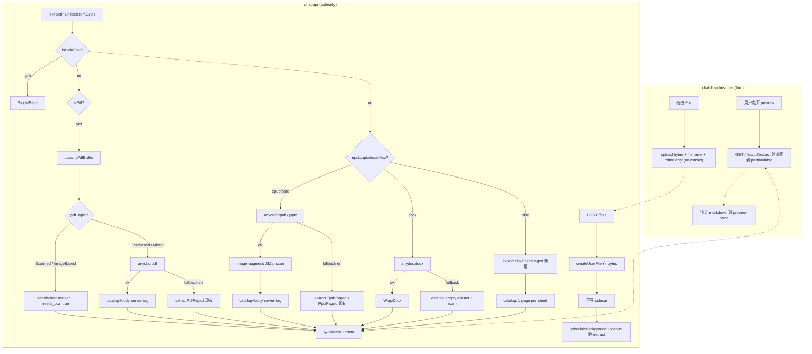

# feat: 文档解析权威迁移到服务端 — anydoc 作为 chat-api 第一层解析器

**Target repos:** `chat-api` 和 `chat-llm-christmas`  
**Date:** 2026-08-07  
**Depth:** Standard  

## Summary

把文档解析的唯一权威放到 chat-api 服务端：

- **chat-api**：引入 `@firecrawl/anydoc-wasm` 作为 `extractPlainTextFromBytes` 的第一层解析器，覆盖 pdf/epub/pptx/docx；现有 unpdf/JSZip 路径降为兜底；新增服务端 xlsx SheetJS parser（与浏览器现行 catalog 结构对齐）；pdf 走 `classifyPdfBuffer` 预分类把 Scanned/ImageBased PDF 短路到现有 placeholder 链路；epub/pptx 在 anydoc 成功后用 image-augment 补回 `epub_image_pages` / `pptx_image_slides`；加 `ANYDOC_ENABLED` 环境变量（默认 1，`0` 一键回退）。
- **chat-llm-christmas**：**删除** `@firecrawl/anydoc-wasm` 依赖 + `lib/files/ingest/anydoc.ts` + `lib/files/ingest/anydoc-paging.ts`；上传附件时不再传 multipart `extract` 字段，预览面板改为异步 `GET /files/:id/extract`，section 显示 "解析中…" 直到 ready。

## Problem Frame

现有架构有两份 extraction 实现：

- **浏览器**（chat-llm-christmas）：anydoc-wasm → multipart `extract` 字段 → chat-api 落 sidecar 直接返回
- **chat-api**：独立跑 unpdf / JSZip / pdf-inspector；docx 和 xlsx 服务端**完全没有 parser**

后果：

1. 同一份 docx，浏览器上传走 anydoc、API 上传走空——extract 行为不可预测
2. 服务端 `readOrBuildUserFileExtract` 永远不覆盖浏览器传的 extract——服务端**不是 authority**
3. 双份实现漂移：浏览器升级 anydoc-wasm 不会同步 chat-api 的 JS 路径
4. 浏览器 wasm 6.5MB bundle 成本 + 大 PDF 内存风险
5. Scanned PDF 等需要 OCR 的 case 在浏览器侧根本没有 fallback 机制

业界主流（Google Drive / Dropbox / Notion / unstructured / LlamaParse）都是**服务端权威+preview 异步**的形态。

## Requirements

- **R1** chat-api 在 `extractPlainTextFromBytes` 中以 anydoc 作为 pdf/epub/pptx 的第一层解析器，失败时落到现有 JS parser
- **R2** chat-api 新增 docx / xlsx **服务端独立 parser**——不再依赖前端 extract
- **R3** Scanned/ImageBased PDF 在 anydoc **之前** 被 `classifyPdfBuffer` 短路到 placeholder + `needs_ocr=true`
- **R4** anydoc 成功的 epub/pptx 通过 image-augment 补回 `epub_image_pages` / `page_image_refs` / `pptx_image_slides`（下游 OCR 路由不回归）
- **R5** chat-llm-christmas 彻底删除 anydoc-wasm 依赖；不再上传 multipart extract 字段
- **R6** 浏览器 attachment UI 在 attachment.text 为空时**异步拉取** `GET /files/:id/extract`（或新 preview API），期间显示"解析中…"
- **R7** `ANYDOC_ENABLED` 环境变量（默认 `1`，`0` 关闭）；部署侧零配置变更（npm install 自动带 wasm）
- **R8** sidecar 形状不变：`--- page N ---` marker + meta 字段（`pdf_type` / `epub_image_pages` / `pptx_image_slides` / `needs_ocr`）；anydoc 输出包装为 catalog+body，server 的 catalog note 是 `"via @firecrawl/anydoc-wasm (server)"`
- **R9** 用户上传大文件（>10MB）时在前端先收到"预计解析 N 秒"反馈，体感不卡

## Key Technical Decisions

- **KTD1 (session-settled: user-directed — chosen over "browser preview wasm + server 独立跑" 和 "保持现状 + chat-api parity")**  
  只保留**服务端一份解析实现**。浏览器删 wasm。preview 走服务端异步 fetch。理由：(a) 单份实现消除漂移；(b) 浏览器 bundle 减 6.5MB；(c) 服务端 Node 没有 wasm memory 上限焦虑；(d) 业界主流形态（参考 unstructured `auto`、LlamaParse tiers）；(e) **架构原则：前端只做 UI 渲染 + 简单 API 对接**。代价：attachment 初次预览要等 upload + extract ~1-3s，**仅首次**（sidecar 写盘后秒回）。

- **KTD1.1 (session-settled: user-directed)**  
  KTD1 推到极致——浏览器侧连 zip 解压（members catalog）和 SheetJS（xlsx sheet catalog）都不再跑。chat-llm-christmas 的 `lib/files/ingest/extractors/` 整个目录删除；`jszip`/`mammoth`/`epubjs`/`xlsx` 等依赖若 grep 确认仅 ingest 用则全部卸载。前端 attach card 只展示 base metadata + image 缩略图。zip members 与 spreadsheet tab 等内容均经服务端 extract 产生 sidecar 后由 preview 渲染。

- **KTD2 (session-settled: user-directed — chosen over "B 提升 readOrBuildUserFileExtract")**  
  接入点是 chat-api `src/services/fileExtract.js` 的 `extractPlainTextFromBytes` 内部、`isEpub` 分支**之前** 插入统一 anydoc 尝试块（式样 A）。background continue (`scheduleBackgroundContinue`) 自动跟随。

- **KTD3 (session-settled: user-directed — chosen over "accept loss of image refs")**  
  anydoc 成功结果**追加** image-augment：JSZip 对原始 bytes 做一次轻量扫描，把 `epub_image_pages` / `page_image_refs` / `pptx_image_slides` 合并回返回。file_read OCR 路由不回归。

- **KTD4 (session-settled: user-approved)**  
  `ANYDOC_ENABLED` 环境变量，默认 `'1'`；设为 `'0'` 跳过 anydoc，行为完全等价于 upgrade 前，回退不需要 git revert。chat-llm-christmas 侧删除 wasm 是**不可逆**——但只是代码删，igr spilled git revert 行为清晰。

- **KTD5**  
  pdf 走 `classifyPdfBuffer` **在 anydoc 之前**——Scanned/ImageBased PDF 短路 placeholder + `needs_ocr=true`（现有链路），TextBased/Mixed 走 anydoc，ConvertError ∈ {unsupported, malformed, encrypted, resourceLimit, missingPart} fallback 到 unpdf 现有路径。

- **KTD6**  
  xlsx **不走 anydoc 主路**：SheetJS 的 sheet/catalog 结构 > anydoc 的 CSV-style flat markdown。服务端新增 `extractXlsxSheetPaged(bytes, filename)`，产出与 chat-llm-christmas 现行 `extractSpreadsheetText` 同样的多 sheet catalog（每 sheet 一页）。

- **KTD7**  
  chat-api **不**实现 preview API。预览直接用现有 `GET /files/:id/extract`（sidecar 缺失时会现做，meta 字段 `partial: true` 标识"还在跑 background"，浏览器轮询 1-2s 直到 `partial: false`）。

- **KTD8**  
  catalog 的 source note是 `"via @firecrawl/anydoc-wasm (server)"` ——chat-llm-christmas 不再产 catalog，**不需要**对齐 browser/server 命名。

## High-Level Technical Design

## Implementation Units

### U1. chat-api: 引 `@firecrawl/anydoc-wasm` + node loader helper

- **Goal**：Node 环境拿到 wasm 模块 + 同步 `async anydocToMarkdown(bytes, format)`，memoize init promise。
- **Requirements**：R1, R2, R7
- **Dependencies**：—
- **Files**：
  - `chat-api/package.json`（加依赖 `"@firecrawl/anydoc-wasm": "^0.1.7"`，与 chat-llm-christmas 同版）
  - `chat-api/src/services/anydocWasm.js`（新，~40 行）— `initAnydoc()` memoized；`isEnabled()` 读 env；`anydocToMarkdown(bytes, format)`；`classifyFallbackError(err) → bool`
- **Approach**：`fs.readFileSync(require.resolve('@firecrawl/anydoc-wasm/anydoc_wasm_bg.wasm'))` + `initSync({ module: bytes })`；memoize 单例 promise；失败时把 `error.code` 保留抛
- **Patterns**：`chat-llm-christmas/lib/files/ingest/anydoc.ts` 中 Node 分支
- **Tests**（`chat-api/tests/anydoc-wasm.test.js`）：
  - happy: 对 fixture docx 调 `anydocToMarkdown` → 非空 string
  - env: `ANYDOC_ENABLED=0` → `isEnabled()` === false
  - env: 默认 / `=1` → enabled
  - fallback: 模拟 wasm load fail → 接口仍 200（fallback 走 JS）
- **Verification**：`node --test tests/anydoc-wasm.test.js`

### U2. chat-api: `extractPlainTextFromBytes` 第一层接入 + docx/xlsx parser 补全

- **Goal**：把 anydoc 作为第一层接进调度层；新增 docx/xlsx 服务端 parser
- **Requirements**：R1, R2, R3, R4, R8
- **Dependencies**：U1
- **Files**：
  - `chat-api/src/services/fileExtract.js`（改）
  - `chat-api/src/services/imageScan.js`（新）— epub/pptx JSZip 扫 image refs
  - `chat-api/src/services/xlsxSheetExtract.js`（新）— SheetJS 服务端 xlsx parser；要新增 `"xlsx": "^0.18.5"` 到 package.json
  - `chat-api/src/services/pagedSerialize.js`（新）— `buildCatalogPage` / `serializePagedExtract` 帮助函数（与 chat-llm-christmas 的 `paged-extract.ts` 对齐）
- **Approach**：
  1. `extractPlainTextFromBytes` 在 `isPlainText` 之后做统一调度：
  2. **PDF**：先 `classifyPdfBuffer`；`pdf_type ∈ {Scanned, ImageBased}` 走原有 placeholder 短路；否则 `anydocToMarkdown(bytes,'pdf')`，ConvertError fallback 到 `extractPdfPaged`
  3. **EPUB/PPTX**：先试 `anydocToMarkdown`；成功后跑 `imageScan.js`（JSZip 读 zip 入口 + 正则扫 ``）合并 `page_image_refs`；失败 fallback `extractEpubPaged`/`extractPptxPaged`
  4. **DOCX**：新分支 `anydocToMarkdown(bytes,'docx')`；失败返回 empty + warning log
  5. **XLSX**：调用 `xlsxSheetExtract.extractXlsxSheetPaged(bytes, filename)` —— 用 SheetJS 拆 sheet → catalog page 1 + 每 sheet 一页 TSV body
  6. anydoc 成功结果统一经 `pagedSerialize.buildAnydocCatalogBody(markdown, { filename, source:'server' })` 包装为 catalog page 1 + body page 2；source note `"via @firecrawl/anydoc-wasm (server)"`
- **Patterns**：`chat-llm-christmas/lib/files/ingest/anydoc.ts` 的 `pagedExtractWithSource`、`chat-llm-christmas/lib/files/ingest/extractors/spreadsheet.ts` 的 sheet catalog 结构
- **Tests**（`chat-api/tests/anydoc-extract.test.js` 新）：
  - pdf text-based → anydoc → text 含 GFM
  - pdf scanned → placeholder + `needs_ocr=true`+`pdf_type='Scanned'`（未走 anydoc）
  - pdf anydoc fails (mock ConvertError) → fallback unpdf 结果
  - epub → text 含 `# Chapter` + `epub_image_pages` 非空（image-augment 填充）
  - pptx → text 含表格 + `pptx_image_slides`
  - docx → 服务端独立解析（不需要前端 extract）
  - xlsx → 服务端独立输出 sheet catalog + TSV
  - ANYDOC_ENABLED=0 → 全部走现有 JS 路径（快照前）
- **Verification**：`npm test` 通过；现有 `tests/epub-pptx-extract.test.js` + `tests/pdf-ocr-merge.test.js` 不删

### U3. chat-api: 环境开关 + 文档

- **Goal**：部署回退能力 + 文档同步
- **Requirements**：R7
- **Dependencies**：U1, U2
- **Files**：
  - `chat-api/src/config.js`（读 env，默认 '1'）
  - `chat-api/README.md`（新段 "server-side document extraction"：两层调度 + ANYDOC_ENABLED 说明 + 各种格式的解析覆盖表）
  - `chat-api/deploy/deploy.sh`（**不需要**改：rsync 排除 node_modules + 远端 npm install --omit=dev 自动带 wasm）
- **Approach**：config.js 加 `anydocEnabled`；README 更新；deploy 文档验证 npm install 之后 wasm 文件存在于 node_modules 之下
- **Tests**：
  - `ANYDOC_ENABLED=0/1/undefined` → 对应 boolean
- **Verification**：manual + config 单测（可放入 tests/anydoc-wasm.test.js 内）

### U4a. chat-llm-christmas: 删 wasm / 服务端 extract / zip+spreadsheet 浏览器侧 —— 彻底 thin client

- **Goal**：浏览器只做 base metadata + 图片压缩；不做任何文档内容解析；preview 完全由服务端 extract 提供
- **Requirements**：R5, R6, R9
- **Dependencies**：chat-api U1-U3 已 deploy 上线
- **Files**:
  - `chat-llm-christmas/package.json`（删 dep）：`@firecrawl/anydoc-wasm`、`mammoth`、`jszip`（若只在 ingest 用）、`epubjs`（若只在 ingest 用）、`unpdf`、`pdfjs-dist`（若只在 ingest 用）、`xlsx`（若只在 spreadsheet.ts 用）——实施时逐一 grep 引用确认
  - `chat-llm-christmas/lib/files/ingest/anydoc.ts`（**删**）
  - `chat-llm-christmas/lib/files/ingest/anydoc-paging.ts`（**删**）
  - `chat-llm-christmas/lib/files/ingest/index.ts`（改）— `ingestFile` 只做：validate accept + size + image compress + 返回 base metadata；不再调任何 extract
  - `chat-llm-christmas/lib/files/ingest/extractors/*`（**全删**，包括 `pdf/docx/pptx/epub/spreadsheet/zip/index.ts`）——zip members catalog / spreadsheet sheet catalog 全部由服务端 extract 输出后由 preview 渲染
  - `chat-llm-christmas/lib/files/ingest/support.ts`（瘦身）— 保留 `isSupportedDropFile` / `isLegacyOleOfficeFile` / `formatByteSize`；删 `sniffIngestKind`（前端不再用 magic-byte 嗅探——浏览器只做 UI 接受判断）；删 `zipMemberExtractKind`
  - `chat-llm-christmas/lib/files/ingest/typecheck.ts`（保留）
  - `chat-llm-christmas/lib/files/ingest/image-utils.ts`（保留）— image compress / thumbnail 仍然浏览器侧做（image 的"渲染"逻辑，不属于文档内容解析）
  - `chat-llm-christmas/lib/files/ingest/types.ts`（改）— `IngestedAttachment.text?: string`（不再由前端 set）；加可选 `pendingExtract?: boolean`
  - `chat-llm-christmas/hooks/chat/use-attachments.ts`（改）— upload multipart: `{file, purpose, model}`，**不含 extract**
  - `chat-llm-christmas/components/files/FilePreviewPane.tsx`（或 preview 渲染组件）— mount 时若 `attachment.text` 空 且 `fileId` 存在 → fetch `GET /files/:id/extract`；spinner；错误态
  - `chat-llm-christmas/tests/files/ingest-anydoc-e2e.test.ts`（**删**）
  - `chat-llm-christmas/tests/files/ingest-support.test.ts`（**删或重写**为只测 `isSupportedDropFile`）
  - `chat-llm-christmas/tests/files/fixtures/{tables.docx, book.epub, pres.pptx}`（**删** — 已拷到 chat-api U5）
  - `chat-llm-christmas/lib/files/README.md`（改）— "本仓不产出权威 extract；ingest 只做校验 + image 压缩；preview 数据从 chat-api 拉"
- **Approach**：
  1. 查 `package.json` 所有 dep，逐个 grep 决定是否仅服务于 extract；删除
  2. 删 `lib/files/ingest/anydoc*` 和 `extractors/` 目录
  3. `ingestFile` 精简：validate accept + 大小 + image compress + 返回 base metadata
  4. `use-attachments` multipart: `{file, purpose, model}`
  5. Preview pane mount → fetch extract；attachment `pendingExtract: true` → UI 显 "解析中…"
  6. zip/xlsx 拖入 preview 显示"等待服务端解析"，extract 就绪后渲染服务端返回的 catalog + body
- **Patterns**：`file_read` 的 fetch extract 模式
- **Tests**：
  - attachment.text 默认 undefined
  - upload multipart 不含 extract
  - preview pane 通过 mock fetch 渲染
  - 大文件 size hint
  - 不再 import wasm / mammoth / jszip / epubjs / unpdf / pdfjs-sheetjs（lint + grep）
- **Verification**：`npm test` + 手测连续拖 docx / xlsx / zip / epub / pptx / pdf → 上传 → preview 等服务端 → 显示

### U4b. chat-llm-christmas: chat history refs / quote toolbar / file_read 兼容空 text

- **Goal**：`attachment.text` 语义改变（可能为空）后，下游 quote toolbar / `formatChatFileHistoryRefs` / file_read 等现有消费仍正常
- **Requirements**：R6
- **Dependencies**：U4a
- **Files**：
  - `chat-llm-christmas/components/chat/QuoteToolbar.tsx`（改）— quote toolbar 现在不能依赖 attachment.text 已有内容；改为触发 fetch extract 后基于结果 quote
  - `chat-llm-christmas/lib/chat/format/file-history-refs.ts` 或 `formatChatFileHistoryRefs`（可能改）— attachment.text 为空时 history ref 序列化**退化为 reference by id**（file_read 时 pull 服务端 extract）；不破现有 `【历史文件引用】` 格式
  - `chat-llm-christmas/lib/chat/composer/download.ts`（如有依赖）— 检查（保留）
  - `chat-llm-christmas/lib/files/attached-file-blocks.ts`（检查）
  - `chat-llm-christmas/lib/files/preview.ts`（检查）
- **Approach**：
  1. 全文搜 `attachment.text` / `.text` 引用，列出所有下游消费点
  2. 把"已有 extract 文本"的判断改为"已有 sidecar"或"fetching extract in-flight"
  3. `formatChatFileHistoryRefs` 不再读 attachment.text，直接引用 id + size + name
  4. quote toolbar：fetch extract → 选用 window → quote
- **Tests**：
  - 拖入 docx，模型发回复，history refs 仍包含文件（不依赖 text 已有）
  - quote toolbar 选 attachment → 等 fetch 完 → quote 文本正确
  - 空 attachment.text 不崩 UI
- **Verification**：聚焦回归 + 手测一轮完整 chat flow

### U4c. chat-llm-christmas: 迁移 `docs/anydoc-paging.md` 为 stub，权威移到 chat-api

- **Goal**：文档权威迁移；chat-llm-christmas 留 stub 指引
- **Requirements**：R8
- **Dependencies**：chat-api U1-U3 完成
- **Files**：
  - `chat-api/docs/anydoc-paging.md`（**新 / 迁**）——chat-llm-christmas 现有 `docs/anydoc-paging.md` 的内容做"服务端契约版本"重写：删浏览器侧懒加载段、强调服务端 initSync 注入、强调 "via (anydoc-server)" catalog note、markdown + page markers 同 R8
  - `chat-llm-christmas/docs/anydoc-paging.md`（**改写**）——保留作为 stub，3 行说明："This contract is now owned by chat-api. See `chat-api/docs/anydoc-paging.md`. The client is a thin render side that does not produce extract."
- **Approach**：把旧文档里"两层路由器 / `ANYDOC_ROUTED_KINDS` / `--- page N ---` 序列化"段落直接搬到 chat-api
- **Tests**：
  - chat-llm-christmas 文档 stub 包含 chat-api 链接
  - chat-api 文档不全等 chat-llm-christmas 旧版（已按新架构重写）
- **Verification**：manual review

### U5. 跨仓 parity e2e（chat-api 内）

- **Goal**：chat-api 对 fixture 产出与 chat-llm-christmas 之前 anydoc 输出**同形状**（catalog note 改为 server）
- **Requirements**：R8
- **Dependencies**：U2
- **Files**：
  - `chat-api/tests/fixtures/{tables.docx, book.epub, pres.pptx}`（从 chat-llm-christmas 拷贝）
  - `chat-api/tests/anydoc-extract.test.js`
- **Approach**：复用 chat-llm-christmas 旧 e2e 的断言结构；catalog note 应为 `(anydoc-server)`
- **Tests**：
  - docx → markdown 表格存在
  - epub → 章节 anchor + 表格 + image refs
  - pptx → GFM 表格 + 说话者注记 + slide 顺序
- **Verification**：`node --test`

## Scope Boundaries

**In scope**：chat-api 服务端全格式 anydoc parser；ANYDOC_ENABLED；image-augment；xlsx server parser；chat-llm-christmas 删 wasm / 删 zip+spreadsheet 浏览器 extract / 改 upload multipart / preview 异步；chat history refs 兼容空 text；anydoc-paging.md 权威移到 chat-api；文档同步。

**核心原则**：chat-llm-christmas（前端）只做 UI 渲染 + 简单 API 对接；所有文档内容解析（含 zip members / spreadsheet sheet catalog）权威都在 chat-api。

**Deferred to Follow-Up Work**：
- 不拆 PDF 逐页（anydoc PDF 无 page boundary）
- 不动 `pdfOcr.js` / Scanned PDF placeholder / GET /files/:id/extract JSON 字段
- 不引入 unstructured / markitdown / docling / VLM OCR 新依赖
- 不动任何与 OCR / VLM 相关 prompt
- 服务端 >20MB 文件上限不变（现有限制已生效）
- chat-llm-christmas 保留 image compress / thumbnail（本地图片渲染需要，不属于"文档内容解析"）

## Risks & Dependencies

| 风险 | 影响 | 缓解 |
|---|---|---|
| chat-api 部署滞后于 chat-llm-christmas → 浏览器上传 attachment 永远 pending | 用户看不见 extract | 分阶段发：**先发 chat-api**，验证 post /files 后 sidecar 起，再发 chat-llm-christmas 删 wasm 部分；中间窗口期间浏览器 attachment.text 可能为空，UI 引导"加载中…" |
| anydoc 版本与浏览器**已无 wasm**后无版本对齐问题 | — | 只需 chat-api 内嵌版本即可 |
| 大 PDF (>10MB) 上传 + 解析 >15s 用户体感差 | UX | U4 加 size hint；服务端 background continue 机制（限 40 页 sync → 500 页 background）已存在 |
| chat-api CPU 在大量同步上传下挤 | latency | sync 限 25s；任何超时都会 retry background；VPS 资源现无监控，需要时移 queue |
| wasm OS/arch binary 兼容 | deploy fail | Ubuntu x64 上 wasm 纯 Rust 无 native deps，已被 pdf-inspector 使用先行验证过 |
| Scanned PDF 走 placeholder 但**不在 anydoc 之前** classify | OCR 链路破坏 | 严格按 KTD5 顺序——classifyPdfBuffer 在 anydoc 之前 |

## Acceptance Examples

- **AE1** API programmatic 上传 `report.docx`（无 extract 字段）→ 5s 后 `GET /extract` 返回 markdown 含表格
- **AE2** 用户上传 scanned `handout.pdf` → sidecar 是 placeholder + `needs_ocr=true`+`pdf_type='Scanned'`；OCR 流程不变
- **AE3** 设 `ANYDOC_ENABLED=0` 重启 → 行为与升级前完全一致（快照）
- **AE4** 上传 `sales.xlsx` → sidecar 含 sheet catalog + TSV body
- **AE5** 上传 `book.epub` → text 含 `# Chapter One` + `epub_image_pages` 非空；file_read 调用方 OCR 可达
- **AE6** 浏览器拖入 `report.docx` → attachment 卡立即出现 → 上传 + 后台解析 → 用户点开 preview 看到一个"解析中"→ 1-3s 后显示内容
- **AE7** chat-llm-christmas 的 bundle 减少 6.5MB，无 `anydoc-wasm` import
- **AE8** 聊天产生带 attachment 的 history refs 时不依赖 attachment.text 已存在（服务端权威，客户端 UI 拉取）
- **AE9** chat-api `docs/anydoc-paging.md` 为新权威契约文档；chat-llm-christmas 旧文档被改为 stub 3 行指引

## Open Questions

- anydoc 处理超长 EPUB（>500k chars）是否在 25s sync 上限内？实现时若发现逼近则该格式也走 sync 截断 + background continue（模式同 pdf）
- anydoc 未来若暴露 page-tagged blocks，PDF 逐页拆分重启
- `package.json` 中 `jszip`/`epubjs`/`unpdf`/`pdfjs-dist`/`xlsx` 是否仅在 ingest/extractors 中被引用？实施时逐个 grep 核实后再卸载——若有其它用途（例如 markdown 处理某些 case）则保留

## Sources & Research

- 仓内调研（chat-llm-christmas）：`lib/files/ingest/anydoc.ts`、`lib/files/ingest/anydoc-paging.ts`、`docs/anydoc-paging.md`（迁）、`lib/files/ingest/extractors/{pdf,epub,docx,pptx,spreadsheet,zip}.ts`、components/chat/QuoteToolbar.tsx、lib/chat/format/file-history-refs.ts、hooks/chat/use-attachments.ts
- chat-api 调研：`src/services/fileExtract.js`（L497-533 调度）、`src/services/fileStore.js`（sidecar 直写）、`src/services/pdfOcr.js`（page merge/OCR 路由依赖 `epub_image_pages` / `pptx_image_slides`）、`deploy/deploy.sh`（VPS 部署）
- 外部：
  - [firecrawl/anydoc README](https://github.com/firecrawl/anydoc) + [wasm/README](https://github.com/firecrawl/anydoc/blob/main/wasm/README.md)
  - [unstructured partitioning docs](https://docs.unstructured.io/open-source/core-functionality/partitioning)（"fast → hi_res → ocr_only"三层调度形态印证）
  - [LlamaParse parsing tiers](https://developers.llamaindex.ai/llamaparse/parse/guides/tiers/)
  - [microsoft/markitdown](https://github.com/microsoft/markitdown)
  - Google Drive / Dropbox attachment preview 形态参考（主流 thin-client 模式）
