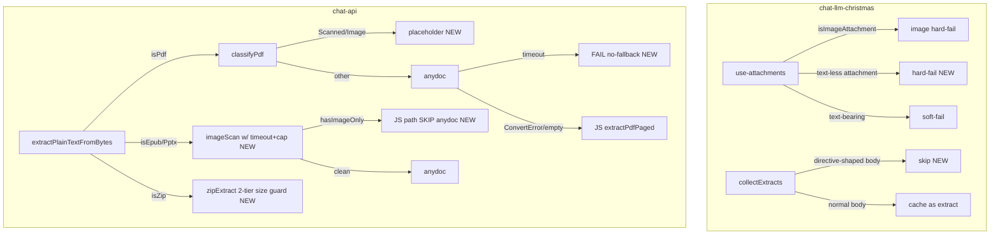

# fix: code-review anydoc findings — P1 corrections across both repos

**Target repos:** `chat-api`（主要）+ `chat-llm-christmas`（主要）  
**Date:** 2026-08-07  
**Depth:** Standard  
**Base branch:** `feat/server-authority-anydoc-parsing`（两仓都沿用，增量 push 到 OPEN 的 PR #42 / #2）

## Summary

008 plan 实施（U1-U5）已经过了 ce-code-review（run `20260807-173853-a629881e-{web,api}`，产物在 `/tmp/compound-engineering-501/ce-code-review/…`）。两党在 06 个独立 P1 与数个 P2。

本 plan 一次修复全部 **P1 (6+3=10 项，去重后 8 项）**、**P2 (7 项）**、**P3 一致性问题 （5 项）**。

在 chat-api 侧的 shape 决策：**anydoc epub/pptx 不再看 2-page wire，而是 image-augment 有内容时回退用 JS extract path** — 这是 plan U2 早就埋下的 hint ("`hasImageOnlyPages` → excerpt js extract with anydoc-augment prose")。这比 remap OCR 索引更简单（不动 pages_needing_ocr 维度），也天然修复 withTimeout-双跑 的触发条件（JS 是最终真相）。

## Problem Frame

008 发布后 review 发现**核心缺口在每侧各 3 个顶级问题**:

**chat-llm-christmas PR #42**
1. 上传失败时文档仍 soft-fail → `uploadError` 设为 `false`，U4b 的 `upload_failed` 永久闸门失效 — 文档被静默丢。
2. `[Attached File]` pointer body 会进 `collectFileExtractsFromMessages` 缓存；gateway 侧 sidecar 未就绪时 `file_read` 静默当成功返回指针文案。
3. 未登录态附件不 upload → 新消息达到发送时文档静默省略。

**chat-api PR #2**
4. anydoc epub/pptx 返回 `totalPages=2` 但 `pages_needing_ocr` 用 spine/slide 序号 → `file_read` OCR 页码语义错乱，image-only 页永不 OCR。
5. zip `uncompressedSize=0` 时 size-guard 跳过 → 成员先全部读进内存再判断 → zip bomb。
6. `imageScan.js` 没 timeout/page cap；anydoc timeout 后 `withTimeout` reject 但 wasm 不 cancel,JS 兜底又跑一遍 → 双倍负载。

**P2** xlsx 大行表先全量 parse 再 slice;`extractPlainTextFromBytes` 对 Scanned PDF 不 placeholder(zip 成员漏契约）;needs_ocr 的测试没断言非空 image page。

## Requirements

- **R1**(chat-llm-christmas)上传失败时，**text-less** 非 image 附件 hard-fail，设 `uploadError: true` + `uploadErrorMessage`（以供 UI 显示）;text-bearing attachment(plain-text）维持 soft-fail。
- **R2**(chat-llm-christmas)`collectFileExtractsFromMessages` 对以 `(` 开头 + `call file_read` 结尾的"directive-shaped" body **跳过**（不存为 extract)。`file_read` 在判断"cache 命中"时同样不认 directive-shaped body。
- **R3**(chat-llm-christmas)`isAccountBound=false` 时，对**非 plain-text** 附件： attach chip 显示警示 tooltip；若发送时只有这类附件 → 报 `needs_login` 错误，触发登录流程；plain-text 附件不受影响（其 text 本来就可以发）。
- **R4**(chat-api)`extractPlainTextFromBytes` 对 `isEpub` / `isPptx` 流程调整：**先跑 imageScan，再决定是否走 anydoc**；若 `imageScan.epub_image_pages.length > 0 || imageScan.page_image_refs` 非空，直接返回 JS path(`extractEpubPaged`/`extractPptxPaged`)，跳过 anydoc。imageScan 自身包 **withTimeout** 与 **page-cap 200**。
- **R5**(chat-api)`extractPlainTextFromBytes` 对 `isZip` 的 size-guard 改为**二级**:`uncompressedSize > 0` 先拦；读取后 `memberBytes.byteLength > ZIP_MEMBER_MAX_BYTES` 立即 fail-closed。
- **R6**(chat-api)`withTimeout` reject(timeout）时**不**继续走 JS 兜底；only ConvertError/empty-markdown 才 fallthrough。为此引入专用 `class TimeoutError`（或 match `err.message === 'extract timeout'`)。为防 wasm 野跑，`anydocToMarkdown` 调用接受 `signal: AbortSignal`(anydoc-wasm 未提供 cancel 时退化为严格 timeout-after-the-fact，但可以避免双跑的高价）。
- **R7**(chat-api)`extractPlainTextFromBytes` 对 `isPdf`：若 `classifyPdfBuffer` 返回 `Scanned`/`ImageBased`，返回 placeholder shape(`pages_needing_ocr=[1..N]`、`needs_ocr=true`、`totalPages=placeholderCount`、`text` 全是 placeholder 行）— same shape as `readOrBuildUserFileExtract` 的 placeholder branch(share helper)。
- **R8**(chat-api)补 xlsx 测试：`MAX_SPREADSHEET_SHEETS=20` 上限、`rows > MAX_ROWS` 时 footer note 有 truncation 提示；needs_ocr parity 测试断言非空 `epub_image_pages`（可用预存的含图 fixture 或者人工构造）。
- **R9**(chat-api + chat-llm-christmas）补zip fat-guard 测试：构造 uncompressedSize=0 但 content > 25MB 的 zip → fall to skip;`needs_ocr` 测试断言 `/pages_needing_ocr/.test(...)`、`imageOnly > 0`。
- **R10** 所有现有 tests 保持 green；不引入新 lint/typecheck 问题。
- **R11**(P3 文档一致）同步以下文档：`chat-api/README.md` 表格（删 docx fallback 完毕的说）;`chat-api/docs/anydoc-paging.md`(`disabled` 不属于 fallback code;PDF 单-body 已 defer 原因）;`chat-llm-christmas/docs/images-and-files.md` §7 表格改指向 chat-api;`chat-llm-christmas/docs/code-organization.md` §4.2;`chat-llm-christmas/docs/anydoc-paging.md` stub 使用 `https://github.com/counterfactual5/chat-api/blob/main/docs/anydoc-paging.md` 绝对 URL。

## Scope Boundaries

**In scope**

- 6 个 chat-api 代码文件的主要改动 (`fileExtract.js`, `imageScan.js`, `zipExtract.js`, `anydocWasm.js`, `anydoc-paging.md`, 相关 tests)
- 4 个 chat-llm-christmas 代码文件的修补 (`use-attachments.ts`, `attached-file-blocks.ts`, `file-read/tool.ts`, `ingest/index.ts` + 文档/README)
- 配套测试 (chat-api `tests/*.test.js`, chat-llm-christmas `tests/chat/turn-helpers.test.ts`, `tests/files/attached-file-blocks.test.ts`, `tests/files/ingest.test.ts`)
- 今天的状态下两仓的 `feat/server-authority-anydoc-parsing` 分支 push；重新 review PR

**Out of scope**

- R6 严 "解析中…" preview loading state(pendingExtract wire，预留 Phase 5)
- 现在 risk 注册但未 fix 的性能因素（wasm 冷启动 6.5MB `readFileSync`、zip `sequential 100 members × 25s`、xlsx 大表 parse)
- chat-api `extractXlsxSheetPaged` 的 streaming parse implementation
- chat-api `extractPlainTextFromBytes` PDF Scanned 的合成 fixture(P1 仅加单测， 不造 fixture)
- 新 preview API / quote toolbar 行为变更
- 当前已开 OPEN PR 中 unrelated 的 change(`lib/chat/session/persist.ts` 等）

**Deferred to Follow-Up Work**（在 PR 描述里写 Known Residuals)

1. **R6 "解析中…" preview UX**:``pendingExtract?: boolean`` 已 reserve 于 `IngestedAttachment`,preview panel 於 mount 时若 `attachment.text` 空 + `fileId` 在 → fetch `GET /files/:id/extract` + spinner.
2. **wasm 冷启动**:`anydocWasm.js` 首次 call 同步 `readFileSync(6.5MB)` 上 event loop; 预处理在 server boot 处做或者 webpack worker 异步 load。
3. **xlsx streaming**:SheetJS `sheet_to_json` 一次全量下掉再 slice 行。
4. **zip sequential**:100 成员 × 25s timeout = worst 42min sync 时间；可用 `Promise.all` with max-concurrency=4 或 queue。

## Key Technical Decisions

### KTD1: anydoc epub/pptx 改为"image-only 优先回退 JS"

.labelled `(session-settled: user-directed — chosen over remap-OCR-indices: 简化契约、不动 pages_needing_ocr 维度)`

Review 建议两条路： (a) remap OCR 索引到 2-page wire; (b) image-heavy 时退出 anydoc。让我复选 **(b)**:

- 不动 `pages_needing_ocr` 的语义维度，契约保持线(n=N)+marker(m=N)+ocr list(n=N)
- anydoc 包 markdown prose就不是为页切片设计——一味 remap 只是把水搅浑， 2-page wire 与 page-N OCR 的根结不解
- imageScan 已经跑完 zip listing + spine walk, 之前决定"是否应该任何 doc"，保持同步性

代价： image-heavy epub/pptx 失去 anydoc 的 markdown-rich 输出（表格 + heading anchors),回 JS path。YMartin 于现实场景： 图-only page 本来就 OCR 优先； anydoc 的 prose 对 OCR foil 是过度优化。

### KTD2: 直接 timeout 时**不**继续 JS 兜底

reliability finding 指出现 code 在 `withTimeout` 拒以后(wasm 仍跑、然后立即 走 JS) -- **双倍 load**，但究性是 timeout 才知道 anydoc "已跑"，有 merged value 下不走 JS。

修法：`withTimeout` line 抛 specialized timeout error；上层 catch 处判 **若 err.code === 'timeout'，吞原 error，不再 fallthrough**(rethrow classes unwrap upstream)。ConvertError(empty markdown 空 mardown）仍 fallthrough。

WASM internal cancel 无 API： 本阶段容忍 "wasm 背景在跑"，但达到两个标：
- JS 不走，省50% CPU
- 等待方立即失败返回 504（不 double-latency)

### KTD3: pointer-body 跳过的"directive-shaped" 判定条件很窄

`(call file_read...)` 的 pattern 在 normal 用户文本中可能出现（引号引文、 markdown 代码 fence 包含这个 string)。判定条件应**只**命中 deterministic 形状：`block.body` 以 `(` 开头 + 全 string `<200` 字符 + 含 `call file_read` + **不含 markdown 标记**(`\n`, `|`, `#`, etc — 一个 directive 就是单 line)。 这样 user-generated "how do I call file_read from markdown" 不会误伤。

### KTD4: ZIP size-guard 二级（listing 时 size-hint 拒 + 读取后 byteLength 拒 ）

JSZip `uncompressedSize` 属于上游 metadata，可信率与恶意 zip 的攻击面低。 fix: size hint 在 listing 时 reject (fail-fast)；读取后 byteLength 超过 limit 也 fail-close — two-layer defense。不影响现有 valid path（缺 size=0 情形 result 也 valid)。

### KTD5: Scanned PDF placeholder 不动 `readOrBuildUserFileExtract` 参管，只共享 helper

`readOrBuildUserFileExtract` 已有 placeholder branch(Scanned 时写 placeholder+meta)。 review 说 zip 成员漏契约——原因： zip 成员的 nested path 调用 `extractPlainTextFromBytes`，直接没走 `readOrBuild`。  
修法： shared `buildScannedPdfPlaceholder({ bytes, classification })` helper， 两边都用。 Sensible scope:`extractPlainTextFromBytes` 的 PDF branch 同样调用 helper 并返回 placeholder shape 为 result。

## High-Level Technical Design

## Implementation Units

### U1. chat-api: timeout 专一 error + no-fallback-on-timeout

- **Goal**:`withTimeout` reject 时不再走 JS 兜底;ConvertError/empty markdown 仍 fallthrough.
- **Requirements**:R6
- **Dependencies**:无
- **Files**:`chat-api/src/services/fileExtract.js`,`chat-api/tests/anydoc-timeout-fallback.test.js`
- **Approach**:
  1. 将 `withTimeout` 从 generic error 改为 throw `{ code: 'timeout', label }` — 保留消息。
  2. 所有 anydoc try/catch 块，重到 insufficient 拆成3层： (a) `if (err?.code === 'timeout')` rethrow 不 catch; (b) `isAnydocFallbackError` fallthrough; (c) others log+fallthrough。
  3. Consequence：截层 dense logging/负责长 failure 可观， upstream caller 502 归来。

- **Patterns**:`withTimeout` 现在返回 reject `new Error(label)`；换成 object literal 不兼容 — 失 funnel 帶 code field即可。
- **Test scenarios**:
  - mock `anydocToMarkdown` 永 await → timeout 后 assert `extractPdfPaged` **不** 被调用、`err.code === 'timeout'` 向上
  - mock anydoc throw `{code:'malformed'}` → 仍走 JS extract
  - mock anydoc return empty string → 仍走 JS extract
- **Verification**:`npm test` 全绿；新专 3 case。

### U2. chat-api: imageScan 超时+页限+ epub/pptx 决策(KTD1)

- **Goal**:image-only 内容量 >= 1 时 epub/pptx 不走 anydoc；imageScan 提前跑并包 withTimeout + page-cap 200。
- **Requirements**:R4
- **Dependencies**:U1(timeout error 一致）
- **Files**:`chat-api/src/services/fileExtract.js`, `chat-api/src/services/imageScan.js`, `chat-api/tests/anydoc-extract.test.js`
- **Approach**:
  1. `imageScan.js`:export `imageScan` 增加 `{ timeoutMs, maxPages = 200 }` opt；内部检查 page 数超 maxPages 返 partial flag `{ truncated: true }`.
  2. `fileExtract.js` 的 `isEpub` / `isPptx` 分支：先 withTimeout(imageScan) (30s)；若 `epub_image_pages.length > 0 || pptx_image_slides.length > 0` → **跳过 anydoc**直接 return withTimeout(extractEpub/PptxPaged)。
  3. 若 scan throw → 走 JS path（安全）。
  4. 移除 `buildAnydocResult` 里现有的 image-augment augment code path（这部分被 R4 替代）。

- **Test scenarios**:
  - book.epub 若含至少 1 `epub_image_pages` → 走 JS path （断言 catalog title 不含 `(anydoc-server)`)
  - pres.pptx 无图 slide → 走 anydoc（断言 `(anydoc-server)` 存在）
  - imageScan 输入 > 200 spine html assert:return `truncated: true` 且 image_image_refs 仅前 200
  - imageScan timeout(人工 stub)assert:抛timeout code，upstream return JS path
- **Verification**:chat-api `npm test`。

### U3. chat-api: zip fat-guard 二级 + scanned PDF placeholder helper

- **Goal**: 两处 P1-zip 和 P2-pdf 修复：size=0 deny + share placeholder helper
- **Requirements**:R5, R7
- **Dependencies**:U1
- **Files**:
  - `chat-api/src/services/zipExtract.js`（修）
  - `chat-api/src/services/fileExtract.js`（增 `scannedPdfPlaceholder` + 调用）
  - `chat-api/tests/zip-extract.test.js`（增 2)
  - `chat-api/tests/scanned-pdf-placeholder.test.js`（增）
- **Approach**:
  1. zipExtract:`perMemberTooBig` 保持 `size > ZIP_MEMBER_MAX_BYTES`；读取 memberBytes 后新增 `if (memberBytes.byteLength > ZIP_MEMBER_MAX_BYTES) skip with 'member size exceeds limit', continue;`。
  2. fileExtract:export `buildScannedPdfPlaceholder(bytes, classification, opts)`，返回 `{ text, totalPages, extractedPages, partial, pdf_type, needs_ocr, pages_needing_ocr, ocr_pages_done: [], ... }`；使 `extractPlainTextFromBytes` `isPdf` 分支在 cls.pdf_type ∈ {Scanned, ImageBased} 时直接调它;return(readOrBuildUserFileExtract 用同一 helper，只是再 write sidecar+meta)。
  3. placeholder text:`--- page 1 ---\n\n--- page 2 ---\n\n...(count 与 cls.page_count_classified / SYNC_PAGE_LIMIT 一致）。

- **Test scenarios**:
  - zip uncompressedSize=0 但 content 30MB → skip with reason "member size exceeds 25MB limit"
  - zip uncompressedSize=30MB（未经读取已出 hint)→ skip with reason“member size > 25MB limit”，不 read `entry.async`
  - `extractPlainTextFromBytes(...)` on scanned mock pdf (mock classifyPdfBuffer 返回 Scanned + 10 pages)→ `needs_ocr=true`,`pages_needing_ocr=[1..10]`,`text` 有 10 个 placeholder marker,`totalPages=10`,`extractedPages=0`,`partial=false`,`extractedPages=0`
  - 同输入 zip 跑 zipExtract → `_data.uncompressedSize=0` 场景 ： 返回幼儿 skip

- **Verification**:chat-api `npm test`。

### U4. chat-api: xlsx/needs_ocr test 补 + docs 一致性

- **Goal**：测试 route 缺口 + docs 一致性(P2)
- **Requirements**:R8, R9, R11 (chat-api side)
- **Dependencies**:U2, U3
- **Files**:
  - `chat-api/tests/anydoc-parity.test.js`（增断言)
  - `chat-api/tests/xlsx-limits.test.js`（新）
  - `chat-api/tests/anydoc-extract.test.js`（增 timeout-fallthrough 与 empty-markdown)
  - `chat-api/README.md`（更新）
  - `chat-api/docs/anydoc-paging.md`（更新 disabled 小贴）
- **Approach**:
  1. parity test 断言非空 `epub_image_pages.length > 0`（用 image-containing fixture 已存在） + assert `pages_needing_ocr` === `epub_image_pages`
  2. `xlsx-limits.test.js`：构造 25-sheet w/ one sheet > 2000 rows → 断言 catalog 含 20 entries + footer note `[note: extracted 20 of 25 sheets]` + `--- page 21 ---` marker absent、row truncation footer present
  3. anydoc-extract 增加 timeout code-only case(U1 都已 cover、这里只 re-assert)、empty_markdown case （仍 JS)
  4. README 表格 docx 行："（暂无： 返回空 + warn)" → 更新描述；docs/anydoc-paging.md "disabled is fallback" 段落改为 "disabled 由 isEnabled gate 于调用前检查，不走 fallback"。
- **Verification**:chat-api `npm test` 全绿；README/docs 改动 diff。

### U5. chat-llm-christmas: upload soft-fail 修复 + directive-body 跳过

- **Goal**：修核心 P1-1 / P1-2
- **Requirements**:R1, R2
- **Dependencies**:无（与 chat-api 独立）
- **Files**:
  - `chat-llm-christmas/hooks/chat/use-attachments.ts`（修 soft-fail)
  - `chat-llm-christmas/lib/files/attached-file-blocks.ts`（新增 `isDirectiveBody` + filter)
  - `chat-llm-christmas/lib/tools/file-read/tool.ts`（在 cache fallback 判 `isDirectiveBody`)
  - `chat-llm-christmas/lib/files/ingest/index.ts`(plain-text 仍走 truncate)
  - `chat-llm-christmas/tests/chat/turn-helpers.test.ts`（增 hook-level 测试）
  - `chat-llm-christmas/tests/files/attached-file-blocks.test.ts`（增 pointer-body 不 collect)
- **Approach**:
  1. `use-attachments.ts`: 消灭 `uploadError: false` 分支；text-less attachment 上传失败统一设 `{ uploading: false, uploadError: true, uploadErrorMessage: msg }`。( `uploadErrorMessage?: string` 加在 `IngestedAttachment` 类型上 — suggests Patch：或 reuse `uploadError` 干扰 analysis)。
  2. `attached-file-blocks.ts`：export `isDirectiveBody(body: string): boolean`。判定：`body.trim().startsWith('(') && body.trim().length < 200 && /call file_read/.test(body) && !/[\n|#\*`]/.test(body)`.在 `collectFileExtractsFromMessages` 的 loop 中 `if (isDirectiveBody(block.body)) continue;`.
  3. `file-read/tool.ts`：在 fallback cache look up 前 filter `if (isDirectiveBody(textFromCache))` 视为 empty。
  4. `ingest/index.ts`:plain-text branch 回调 `truncateAttachmentText` 恢复截断之。

- **Test scenarios**:
  - hook 测试：pdf file upload network fail → assert send disabled；同样 test for txt upload fail → assert send allowed(text-bearing)
  - `collectFileExtractsFromMessages` 传 pointer-shaped "[Attached File: a.pdf] (stored fileId: x)\n(content is stored server-side in the extract sidecar; to inspect it, call file_read with file_id=x)" → 不 collect
  - 同上但 body 改 markdown （含 `#` / newline)→ collect
  - `fileRead` 在 gateway fail + cached pointer body 情景 → 返回 error code 不 succeed
  - ingest plain-text > MAX_ATTACHMENT_TEXT_CHARS：assert truncate marker 存在
- **Verification**:chat-llm-christmas `npm test`.

### U6. chat-llm-christmas: logged-out 文档 gating

- **Goal**:R3 — 未登录态 docs 不发送
- **Requirements**:R3
- **Dependencies**:U5(upload errors一致）
- **Files**:
  - `chat-llm-christmas/hooks/chat/use-attachments.ts`（加 loggedout 提示 AttachChip 红框预示）
  - `chat-llm-christmas/lib/chat/turn/attachments.ts`(`resolvePendingAttachments` 返回 `needs_login` 当 pendingDocRefs / pendingImages 均非空 + !isAccountBound)
  - `chat-llm-christmas/tests/chat/turn-helpers.test.ts`（增）
- **Approach**:
  1. `isAccountBound=false` 时，`ingestFile` 仍执行 attachment chip 置`warning:'Login to attach docs'`（沿线变化 AttachChip UI via new field).
  2. `resolvePendingAttachments` 检查 `!isAccountBound && (pendingDocRefs.length > 0 || pendingImages.length > 0)` → `{ ok: false, error: 'needs_login' }`，上游 UI 触发 login redirect。
  3. `hasTextFiles` gate 相应：text-bearing attach 不在 needs_login 影响范围。
- **Test scenarios**:
  - logged_out + attach pdf + submit with text → error needs_login
  - logged_out + attach txt + submit → allowed (text-bearing)
  - logged_out + attach image + submit → needs_login
  - logged_in + attach pdf + submit → ok
- **Verification**:chat-llm-christmas `npm test`。

### U7. chat-llm-christmas: docs 一致 + anydoc-paging 绝对 URL

- **Goal**:P3 一致性一并修。
- **Requirements**:R11 (chat-llm-christmas side)
- **Dependencies**:U5
- **Files**:
  - `chat-llm-christmas/docs/images-and-files.md` §7 表
  - `chat-llm-christmas/docs/code-organization.md` §4.2
  - `chat-llm-christmas/docs/anydoc-paging.md` stub（绝对 URL)
- **Approach**:
  1. `images-and-files.md`:§7 表格 delete "抽取 / 直传准备 | `lib/files/ingest/*`（格式：`ingest/extractors/...`)"；改为 "上传 metadata | `lib/files/ingest/*`（validate + image compress)；权威 extract | chat-api `extractPlainTextFromBytes`"。
  2. `code-organization.md` §4.2 同步。
  3. `anydoc-paging.md` 把 `../../chat-api/docs/anydoc-paging.md` 改为 `https://github.com/counterfactual5/chat-api/blob/main/docs/anydoc-paging.md`。
- **Verification**:`git diff` 草稿由 docs 一致性 reviewer 确认。

## Verification Contract

**Standalone 要求**（两仓 `npm test` 全绿）:

- `npm test tests/anydoc-timeout-fallback.test.js`（新，chat-api)
- `npm test tests/zip-extract.test.js`（已有， 更新， chat-api)
- `npm test tests/scanned-pdf-placeholder.test.js`（新，chat-api)
- `npm test tests/xlsx-limits.test.js`（新，chat-api)
- `npm test tests/anydoc-extract.test.js`（已有， 更新， chat-api)
- `npm test tests/chat/turn-helpers.test.ts`（已有， 更新， chat-llm-christmas)
- `npm test tests/files/attached-file-blocks.test.ts`（已有， 更新， chat-llm-christmas)
- `npm test tests/files/ingest.test.ts`（已有， 更新， chat-llm-christmas)

**Flags, contract, errors**:
- upload errors 只为 text-less 附件硬化；文本附件 soft-fail 保留
- anydoc timeout 发 `err.code === 'timeout'`；不 fallthrough
- image-augment 非空 → skip anydoc，走 JS；不动 `pages_needing_ocr` 语义
- zip size=0 fail-closed；读取后 byteLength 超 limit 也 fail-close
- placeholder helper 共享；zip 成员 on scanned PDF 有 placeholder，与 top-level path

## Definition of Done

- [ ] chat-api `npm test` 全绿（≥ 107 个）
- [ ] chat-llm-christmas `npm test` 全绿（≥ 760 个）
- [ ] `npx tsc --noEmit` chat-llm-christmas：无新增错误（baseline 4)
- [ ] chat-api `npm run lint` 无新增问题（baseline230后，chat-api 未知 baseline)
- [ ] PR #42 / #2 既有 commits + 新 commits： Review findings 行数减至 0(P0/P1)、文档 update、push 到 feat 分支
- [ ] 测试 schedule 特性： scanned PDF placeholder test 使用 mock classifyPdfBuffer 路径不需真实 Scanned fixture(成本）

## Risks & Dependencies

| Risk | Mitigation |
|---|---|
| 改动 `withTimeout` shape 破坏 chat-api 其它调用者 | grep all `withTimeout` calls；包 backward-compat alias；保留在 files 处理 |
| directive-body 判定过刀割正常用户文本 | KTD3 列了窄narrow条件 （单 line, <200 chars, markdown free, `call file_read` presence) |
| image-heavy epub/pptx 失去 markdown prose (KTD1) | 接受为 tradeoff： OCR 场景本来就 prose-poor； audit 生产 30d 比例 |
| U2 后 anydoc 总 body 是 page 2 而 OCR relations 在 page N | R4 通过"先 imageScan 决定"绕过 本问题， 不动 anydoc wire |
| 修 `use-attachments.ts` 引入回归： image soft-fail 仍应 work | U5 单测断言 image upload fail → 硬 fail 与 original behav. |

## Sources & Research

- **Review artifacts**:`/tmp/compound-engineering-501/ce-code-review/20260807-173853-a629881e-{web,api}/*.json`(8 personas each）
- **Original plan**:`docs/plans/2026-08-07-008-feat-server-authority-anydoc-parsing-plan.md`
- **chat-api PR #2**:https://github.com/counterfactual5/chat-api/pull/2
- **chat-llm-christmas PR #42**:https://github.com/counterfactual5/chat-llm-christmas/pull/42
- **External review findings 处理规则**:`ce-code-review` `references/action-class-rubric.md`(`gated_auto` →下游修；`manual` →由 orchestrator 决）