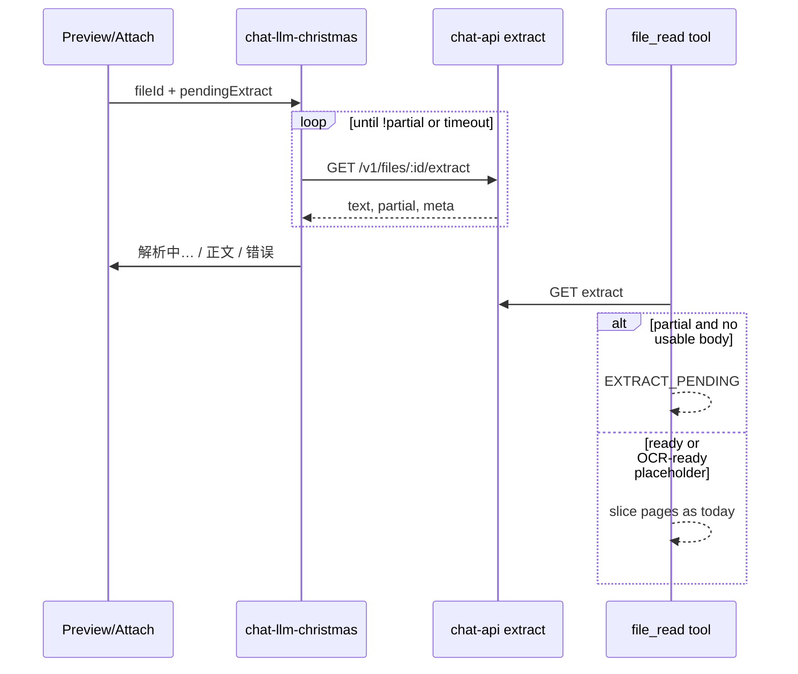
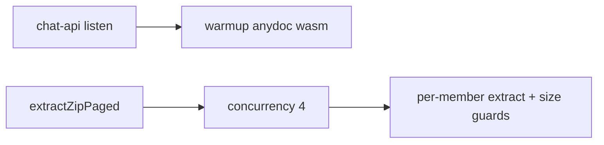

# feat: preview 首字 + extract 吞吐 + file_read pending 契约

**Target repos:** `chat-llm-christmas` + `chat-api`  
**Date:** 2026-08-07  
**Depth:** Standard  
**Origin:** 009 plan Deferred（R6 preview UX）+ ce-optimize 建议三项（用户确认「都做」合一份计划）  
**Product Contract preservation:** Product Contract bootstrap for this plan — no prior requirements-only unified plan; scope affirmed in Phase 0.7.

## Goal Capsule

- **Objective:** thin-client 上线后，用户拖入文档能尽快在预览里看到正文；服务端 extract 冷启动与 zip 多成员更少阻塞；模型侧 `file_read` 在 sidecar 未就绪时返回可重试的 pending，而不是空成功或 pointer 假缓存。
- **Authority:** 本计划 HOW；产品边界继承 008/009（服务端权威 extract，浏览器只 UI + API）。
- **Stop when:** 三阶段验收（预览轮询、吞吐基线改进、file_read pending 契约）与 Definition of Done 勾选完成。

## Product Contract

### Problem Frame

008/009 把解析权威放到 chat-api 后：

1. 浏览器不再生成 `attachment.text`；预览若只靠 inline content，用户看到空卡/文件名直到手动别处触发 extract。
2. `anydoc-wasm` 首次 `readFileSync(6.5MB)` 堵 event loop；zip 成员串行 × 长 timeout 拉高尾延迟。
3. `file_read` 在 extract 慢/partial/网关失败时，历史上曾把 pointer body 当缓存成功；009 修了 directive 跳过，但仍缺 **显式 `EXTRACT_PENDING`** 与对 `partial: true` 空正文的模型友好提示。

### Requirements

- **R1** 非 plain-text 附件在获得 `fileId` 后标记 `pendingExtract: true`；预览打开（或 attach 成功后可选预热）时轮询 `GET /v1/files/:id/extract`，直到 `partial === false` 或超时/失败。
- **R2** 轮询期间 UI 显示「解析中…」；成功后用 sidecar `text` 渲染；失败显示可理解错误（不静默空面板）。
- **R3** 轮询复用/扩展现有 `ensureFileExtractSidecar`（今日只做单次 GET）；间隔约 1–2s，总预算可配置（建议默认 60s）。
- **R4** chat-api 进程启动后（listen 前或 listen 后立即）预热 anydoc wasm，使首次用户 extract 不付冷读成本。
- **R5** zip 成员 extract 改为有界并发（建议 `maxConcurrency: 4`），保留二级 size guard 与 skip 语义；不改变 catalog wire。
- **R6** `file_read`：当 sidecar `partial === true` 且正文对切片无可用内容（空/仅 placeholder 且非 OCR-ready），返回 `{ ok: false, code: 'EXTRACT_PENDING' }`（或等价），提示稍后重试；禁止把 directive-shaped 缓存当成功（009 已有，本计划加回归断言）。
- **R7** 吞吐验收用固定 fixture 墙钟（docx/epub/zip）；不要求本计划内搭完整 `ce-optimize` harness（可 defer）。
- **R8** 不改 OCR 准确率目标；不改 anydoc markdown「美观」；不重做 boot-critical-path。

### Scope Boundaries

**In scope:** preview 轮询 + pending UI；wasm 预热；zip 有界并发；file_read pending 契约与测试。

**Out of scope:** SSE/WebSocket extract 推送；xlsx streaming rewrite；OCR/quality judge；新 preview REST 形态。

### Deferred to Follow-Up Work

- 完整 `ce-optimize` measurement harness（interactive_ms 风格）绑在 extract 吞吐上。
- xlsx 大表 streaming parse。
- Attach chip 上不打开预览也显示全局「解析中」进度条（本计划以 preview panel + 可选 attach 后预热为准）。

## Planning Contract

### Key Technical Decisions

**KTD1 — 轮询而非推送** `(session-settled: user-directed — chosen over SSE: 沿用 GET /extract + partial，008 已定)`  
浏览器对 `GET /v1/files/:id/extract` 短轮询；`partial` 为服务端既有信号。

**KTD2 — 预热在 chat-api boot，不在首请求旁路**  
`loadWasm()` 已 memoize；boot 时主动 `await loadWasm()`（或导出 `warmupAnydoc()`），失败只 log，不阻止 listen。

**KTD3 — zip 并发有界，不无限 parallel**  
`Promise.all` 全开会打爆内存；固定 concurrency pool。成员仍独立 timeout。

**KTD4 — file_read pending 优先于假成功**  
模型重试成本低于错误上下文；`EXTRACT_PENDING` 与现有 `EXTRACT_NOT_FOUND` / OCR 路径并列。

### Assumptions

- Production 已部署 008/009；本计划基于当前 main/feat 合并后的代码。
- `ChatPreviewPanel` 的 `needsTextFetch` 今日多拉 raw file URL；文档类应优先走 extract sidecar（KTD1）。
- Fixture 墙钟在 CI/本地可接受 ±噪声；不设绝对 ms SLA，只要求相对基线有改进或至少不回归。

### High-Level Technical Design

## Implementation Units

### U1. Polling helper for extract sidecar

- **Goal:** 可复用的「等 sidecar ready」API，供预览与 attach 预热调用。
- **Requirements:** R1, R3
- **Dependencies:** none
- **Files:**
  - `lib/files/ensure-file-extract.ts`（扩展）
  - `tests/files/ensure-file-extract.test.ts`（新建或扩展）
- **Approach:**
  1. 保留现有单次 `ensureFileExtractSidecar`。
  2. 新增 `waitForFileExtractSidecar({ fileId, intervalMs, timeoutMs, signal })`：循环 GET，解析 `partial`；`partial === false` 且有可用 `text`（或 OCR-ready meta）则 resolve；超时 reject/返回 `{ ok:false, code:'TIMEOUT' }`。
  3. 不引入 SSE。
- **Patterns:** 现有 `fetchUploadTicket` + `X-Upload-Token`；file_read 的 extract JSON 字段形状。
- **Test scenarios:**
  - mock 连续 `partial: true` → 最终 `false` → resolve 带 text
  - 全程 partial 直至 timeout → 失败码
  - AbortSignal 中止 → 干净退出、无未处理 rejection
- **Verification:** 单测绿；类型导出稳定。

### U2. Preview「解析中…」+ pendingExtract 接线

- **Goal:** 用户打开文档预览时看到加载态，随后看到 sidecar 正文。
- **Requirements:** R1, R2
- **Dependencies:** U1
- **Files:**
  - `lib/files/ingest/types.ts`（`pendingExtract` 已有则接线）
  - `hooks/chat/use-attachments.ts`（upload 成功后对 text-less 设 `pendingExtract: true`，可选 fire-and-forget wait）
  - `components/chat/panels/ChatPreviewPanel.tsx`（及必要时 `FilePreviewOverlay` / routing）
  - `lib/i18n/messages.ts`（解析中文案）
  - `tests/files/file-preview-routing.test.ts` 或新 preview poll 测试
- **Approach:**
  1. Upload 成功拿到 `fileId` 且无 inline text → `pendingExtract: true`。
  2. Preview mount：若无 inline content 且有 `fileId` → 调 U1 wait；spinner + 文案；成功写 content；失败 error。
  3. PDF/EPUB 二进制 viewer 可继续走 URL；**文本型 extract 预览**（docx/xlsx/zip catalog markdown）走 sidecar text。
  4. wait 成功后清 `pendingExtract`。
- **Patterns:** `ChatPreviewPanel` 现有 `needsTextFetch` / loading 分支。
- **Test scenarios:**
  - pending + mock wait resolve → 面板渲染 extract 片段
  - wait fail → 错误文案可见
  - plain-text 附件不进入 pending 路径
- **Verification:** 相关 vitest 绿；手动拖 docx 看 spinner→正文（DoD）。

### U3. chat-api anydoc wasm boot warmup

- **Goal:** 进程起来后第一次用户 extract 不再同步读 6.5MB。
- **Requirements:** R4, R7
- **Dependencies:** none（可与 U1 并行）
- **Files:**
  - `src/services/anydocWasm.js`（导出 `warmupAnydoc`）
  - `src/index.js`（boot 调用）
  - `tests/anydoc-wasm.test.js`（warmup idempotent）
- **Approach:**
  1. 导出 `warmupAnydoc()` = `loadWasm()`。
  2. listen 成功后 `void warmupAnydoc().catch(log)`（或 listen 前 await，二选一：优先 **listen 后不阻塞端口**）。
  3. `ANYDOC_ENABLED=0` 时 no-op。
- **Test scenarios:**
  - 连续两次 warmup 只 init 一次（spy load）
  - disabled → 不抛、不读文件
- **Verification:** chat-api `npm test`；部署后首请求延迟主观/日志确认无冷读尖峰。

### U4. zip member extract 有界并发

- **Goal:** 降低多成员 zip 的墙钟时间，不改 catalog/skip 契约。
- **Requirements:** R5, R7
- **Dependencies:** none（可与 U3 并行）
- **Files:**
  - `src/services/zipExtract.js`
  - `tests/zip-extract.test.js`
- **Approach:**
  1. 将成员处理循环改为 concurrency pool（默认 4，常量可调）。
  2. 保持 uncompressedSize + byteLength 二级 guard。
  3. 结果写入顺序与 catalog 页码映射保持稳定（按成员列表序编号，不按完成序）。
- **Test scenarios:**
  - 多文本成员 zip：catalog + body 与串行语义一致
  - 超限成员仍 skip
  - 可选：计时断言仅作 diagnostic（不硬编码 ms）
- **Verification:** `npm test`；同 fixture 本地前后墙钟记录进 PR 描述。

### U5. file_read EXTRACT_PENDING 契约

- **Goal:** sidecar 未就绪时模型拿到可重试失败，而非空成功/假缓存。
- **Requirements:** R6
- **Dependencies:** none（可与 U1 并行；与 U2 独立）
- **Files:**
  - `lib/tools/file-read/tool.ts`
  - `tests/tools/file-read*.test.ts`（或现有 suite）
  - 必要时 `lib/files/attached-file-blocks.ts`（仅当断言缺口）
- **Approach:**
  1. Gateway extract `ok` 且 `partial === true` 且 `!text.trim()` 且非 OCR-ready → `EXTRACT_PENDING`。
  2. 保留 009 `isDirectiveBody` 缓存过滤；补集成测试：gateway fail + 仅 pointer → 不成功。
  3. Tool 结果文案提示「稍后重试 file_read」。
- **Test scenarios:**
  - partial + empty → EXTRACT_PENDING
  - partial + 有正文页 → 仍可切片（不误杀）
  - directive cache + gateway 404 → 失败非成功
  - needs_ocr placeholder → 仍走既有 OCR 路径（不改成 PENDING）
- **Verification:** vitest 绿。

### U6. Fixture 墙钟记录 + 文档一点

- **Goal:** R7 可核对；README/files 文档提到 preview 轮询与 PENDING。
- **Requirements:** R7
- **Dependencies:** U3, U4
- **Files:**
  - `chat-api/README.md`（一小段）或 `docs/images-and-files.md`
  - 可选 `tools/eval/extract/measure.mjs`（轻量，非完整 optimize）
- **Approach:**
  1. 若加 measure 脚本：对 `tables.docx` / `book.epub` / 合成 zip 打一次墙钟 JSON；列入 `scope` 说明「诊断用」。
  2. 文档写清：preview 轮询、`EXTRACT_PENDING`、wasm warmup。
- **Test expectation:** none for docs-only；若有 measure 脚本则 smoke 能跑通。
- **Verification:** 文档与可选脚本路径正确。

## Verification Contract

- chat-llm-christmas: `npm test` 全绿；触及 U1/U2/U5 的用例新增通过。
- chat-api: `npm test` 全绿；U3/U4 用例通过。
- 手动：拖 docx → 预览「解析中」→ 正文；大 zip 墙钟不显著差于改前（期望更好）。
- `file_read` 在人工延迟 sidecar 场景返回 PENDING 类错误。

## Definition of Done

- [ ] U1–U6 按依赖合入（可两仓各一条 feat 分支）
- [ ] 预览 pending UX 可演示
- [ ] wasm warmup + zip 并发已部署或 PR ready
- [ ] file_read PENDING + directive 回归测试在
- [ ] 吞吐对比数字写在 PR 描述（哪怕是本地一次）

## Risks & Dependencies

| Risk | Mitigation |
|---|---|
| 轮询打爆 API | 1–2s 间隔 + 单 fileId 单 flight + 超时停 |
| zip 并发内存尖峰 | concurrency=4 + 既有 25MB member cap |
| warmup 拖慢 boot | listen 后再 warm；失败不阻服务 |
| PENDING 过多导致模型死循环 | 文案写清 wait；可选 max retry 由模型侧惯例 |

## Sources & Research

- 008/009 plans；`lib/files/ensure-file-extract.ts`；`ChatPreviewPanel.tsx`；`file-read/tool.ts`；`chat-api` `files.get('/:id/extract')`；`anydocWasm.js`；`zipExtract.js`
- External research: skipped — 本地契约与代码模式已足够
