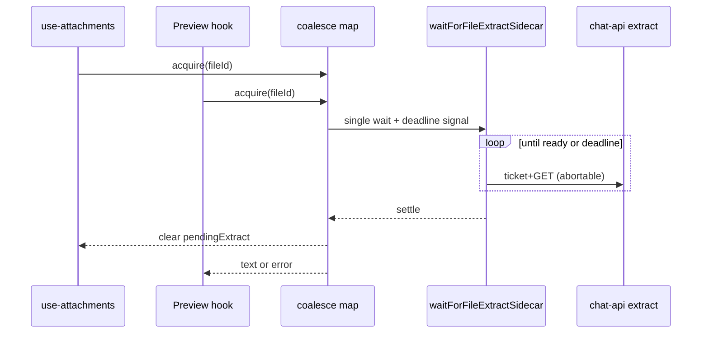
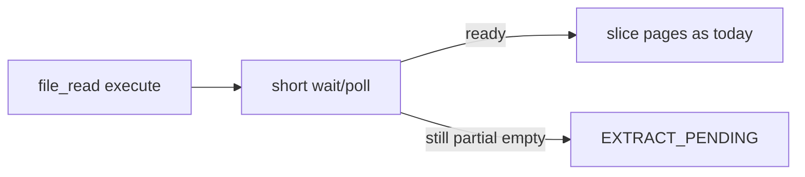

# fix: extract poll reliability + agent parity

**Target repo:** `chat-llm-christmas`  
**Date:** 2026-08-07  
**Depth:** Standard  
**Origin:** ce-code-review of 010 + user chose full residual set (option 3)  
**Product Contract preservation:** Product Contract bootstrap for this plan — no prior requirements-only unified plan; scope affirmed in Phase 0.7 (option 3).  
**Baseline:** Uncommitted post-review fixes on the feature branch are **prerequisites** (OCR list parity, `pendingExtract` cleared on all terminals, permanent extract errors fail-fast, `EXTRACT_PENDING` not masked by non-directive cache, empty OCR preview error). Land those before or with U1.

## Goal Capsule

- **Objective:** Preview/attach extract waiting respects advertised budgets, does not double-poll the same file, is unit-testable, and agents learn about in-flight extract without burning all tool rounds on immediate `EXTRACT_PENDING` retries.
- **Authority:** This plan HOW; product boundary still thin-client + chat-api extract (008–010).
- **Stop when:** All five residual themes have green unit coverage and Definition of Done checks pass.

## Product Contract

### Problem Frame

010 shipped polling preview + `EXTRACT_PENDING`, then review found (and partially fixed) correctness holes. Remaining gaps:

1. `timeoutMs` only checked between polls — hung ticket/extract GET can exceed the 60s budget.
2. Attach prewarm and preview each start an independent wait for the same `fileId`.
3. No lifecycle tests for the preview wait effect (repo has no RTL; panel mount tests are costly).
4. `pendingExtract` is UI-only; agent-visible `docRefBody` never says extract may still be building.
5. `file_read` returns `EXTRACT_PENDING` on the first partial-empty GET; with `MAX_TOOL_ROUNDS=3` and `ok:false` counting as failure, same-turn model retries burn the budget with no wall-clock wait.

### Requirements

- **R1** `waitForFileExtractSidecar` must abort in-flight ticket + extract I/O when `timeoutMs` elapses (and when caller `signal` aborts).
- **R2** `fetchUploadTicket` accepts an optional `AbortSignal` and passes it to `fetch`.
- **R3** Concurrent waits for the same `fileId` share one in-flight poller; preview unmount must not cancel a wait still needed to clear attach `pendingExtract` (refcount / shared promise).
- **R4** Preview extract wait lifecycle (success / non-abort failure / abort / empty body after ok) is covered by unit tests without introducing React Testing Library — prefer a extracted hook/helper.
- **R5** When assembling user content, attachments with `pendingExtract === true` include an agent-visible note that extract may still be building and `file_read` may return `EXTRACT_PENDING` (snapshot at send time).
- **R6** Before returning `EXTRACT_PENDING`, `file_read` performs a short bounded wait/poll of the extract sidecar (same readiness rules as wait helper); if still not ready, return `EXTRACT_PENDING` with tip that discourages same-turn rapid-fire retries.
- **R7** Do not raise `MAX_TOOL_ROUNDS` as the primary fix; do not introduce SSE; do not redo OCR quality or chat-api wasm/zip work.

### Scope Boundaries

**In scope:** deadline abort + ticket signal; per-`fileId` coalesce; preview wait extract-to-hook + tests; agent docRef pending note; `file_read` short poll before `EXTRACT_PENDING`.

**Out of scope:** chat-api changes; Attach chip global progress bar (010 Deferred); SSE extract; raising default tool round caps; introducing `@testing-library/react`.

### Deferred to Follow-Up Work

- Attach chip global「解析中」without opening preview (010 Deferred).
- Full `ce-optimize` extract latency harness (010 Deferred).
- Optional: pass `AbortSignal` through other `fetchUploadTicket` callers (`direct-content`) for consistency — only if touched naturally.

## Planning Contract

### Key Technical Decisions

**KTD1 — Deadline via `AbortSignal.any` + `AbortSignal.timeout`** `(session-settled: user-approved — residual #1 from review option 3)`  
Compose `AbortSignal.any([opts.signal, AbortSignal.timeout(timeoutMs)])` (or equivalent manual controller if runtime gaps) and pass into every `getExtractSidecar` / `fetchUploadTicket` call. Keep the between-poll elapsed check as belt-and-suspenders.

**KTD2 — Shared in-flight map with refcount** `(session-settled: user-approved — residual #2)`  
Module-level `Map<fileId, { promise, controller, refs }>` next to `waitForFileExtractSidecar`. Attach and preview acquire/release; abort underlying controller only when refs hit 0. Preview effect abort releases its ref; attach fire-and-forget holds a ref until settle.

**KTD3 — Extract preview wait into a pure hook/helper** `(session-settled: user-approved — residual #3)`  
No RTL. Move ChatPreviewPanel extract-wait effect into something like `useExtractSidecarPreviewContent` or a non-React async helper + thin hook wrapper, unit-tested with fake timers / stubbed wait.

**KTD4 — Send-time snapshot for pending note** `(session-settled: user-approved — residual #4)`  
`docRefBody` / `assembleUserContent` reads `pendingExtract` at assembly time only. History may retain the note after extract finishes — acceptable; do not rewrite past user messages.

**KTD5 — Short tool-side poll, not higher MAX_TOOL_ROUNDS** `(session-settled: user-approved — residual #5)`  
Reuse wait readiness (or a thin `waitForFileExtractSidecar` with smaller `timeoutMs`, e.g. 3–8s, tighter interval). Prefer shared helper over duplicating GET logic. Tip/system prompt already discourage inventing content; tip should not invite immediate same-turn hammering.

### Assumptions

- Post-review uncommitted fixes land before or with this work.
- Runtime supports `AbortSignal.timeout`; `AbortSignal.any` available in target Node/browser for this app — if not, fall back to manual dual-listener `AbortController` (implementation detail).
- Vitest-only test stack remains; no new React test harness.

### High-Level Technical Design

## Implementation Units

### U1. Deadline AbortSignal through ticket + wait

- **Goal:** Advertised `timeoutMs` bounds in-flight ticket and extract fetches.
- **Requirements:** R1, R2
- **Dependencies:** none (requires baseline fail-fast / OCR patches already present)
- **Files:**
  - `lib/files/direct-upload.ts`
  - `lib/files/ensure-file-extract.ts`
  - `tests/files/ensure-file-extract.test.ts`
- **Approach:**
  1. `fetchUploadTicket(signal?: AbortSignal)` — pass `signal` to `fetch`.
  2. In `waitForFileExtractSidecar`, build deadline signal; pass into `getExtractSidecar`.
  3. `getExtractSidecar` calls `fetchUploadTicket(signal)` then extract GET with same signal.
- **Patterns:** `AbortSignal.timeout` usage in `lib/tools/web-read/reader.ts` / `lib/tools/search/engine.ts`.
- **Test scenarios:**
  - Hung extract `fetch` never resolves → wait returns `TIMEOUT` / abort within ~`timeoutMs` (fake timers + deferred promise).
  - Caller `AbortSignal` aborts mid-ticket or mid-GET → `ABORTED`.
  - Existing success / EXTRACT_EMPTY / EXTRACT_FAILED paths still pass.
- **Verification:** ensure-file-extract tests green.

### U2. Coalesce waits per fileId

- **Goal:** One poller per `fileId` for attach + preview; safe abort semantics.
- **Requirements:** R3
- **Dependencies:** U1
- **Files:**
  - `lib/files/ensure-file-extract.ts` (or small sibling module imported by it)
  - `hooks/chat/use-attachments.ts`
  - `components/chat/panels/ChatPreviewPanel.tsx` (or the U3 hook)
  - `tests/files/ensure-file-extract.test.ts`
- **Approach:**
  1. Export `waitForSharedFileExtractSidecar` (or make coalesce the default entry used by UI).
  2. Refcount acquire/release; only abort shared controller at zero refs.
  3. Attach uses shared wait (still fire-and-forget for UI); preview uses shared wait + its signal as a ref release on unmount.
- **Patterns:** none local for request coalesce — keep API small; do not invent a general HTTP pool.
- **Test scenarios:**
  - Two concurrent callers same `fileId` → single underlying fetch sequence (spy call count).
  - First caller releases/aborts while second still held → wait continues until second releases or settle.
  - Distinct `fileId`s do not share.
- **Verification:** coalesce tests green; manual attach+open preview does not double ticket storm.

### U3. Preview extract hook + lifecycle tests

- **Goal:** Unit-testable preview wait outcomes without RTL.
- **Requirements:** R4
- **Dependencies:** U2 (hook should call shared wait)
- **Files:**
  - New helper/hook under `hooks/chat/` or `lib/files/` (prefer thin hook over panel bloat per `docs/code-organization.md` / chat README)
  - `components/chat/panels/ChatPreviewPanel.tsx` (wire hook)
  - `tests/files/` or `tests/chat/` new test file
- **Approach:**
  1. Extract the extract-wait branch from the panel effect into a hook/helper returning `{ content, error, extracting }` or a testable async function used by the effect.
  2. Preserve empty-body-after-ok → `extractPreviewFailed` behavior from baseline.
  3. PDF/EPUB/URL paths stay in the panel.
- **Patterns:** `needsExtractSidecarPreview` in `lib/files/preview.ts`; existing panel abort cleanup.
- **Test scenarios:**
  - Shared wait ok with text → content set, extracting false.
  - Wait `EXTRACT_EMPTY` / `TIMEOUT` → error message, not blank content.
  - Wait `ABORTED` → no error flash.
  - Ok with empty text → treat as preview failure (baseline).
- **Verification:** new unit tests green; panel still shows「解析中…」manually.

### U4. Agent-visible pendingExtract note

- **Goal:** Models see in-flight extract at send time.
- **Requirements:** R5
- **Dependencies:** none (can parallel U1–U3); uses existing `pendingExtract` field
- **Files:**
  - `lib/chat/turn/attachments.ts`
  - `tests/chat/turn-helpers.test.ts`
- **Approach:**
  1. Extend `docRefBody(fileId, opts?: { pendingExtract?: boolean })` or branch in `assembleUserContent` when `a.pendingExtract`.
  2. Wording: server extract may still be building; `file_read` may return `EXTRACT_PENDING` until ready; do not invent contents.
  3. Snapshot only — no live rewrite of history.
- **Patterns:** existing pointer / `docRefBody` shape; `FILE_READ_SYSTEM_PROMPT` EXTRACT_PENDING line (baseline).
- **Test scenarios:**
  - `pendingExtract: true` → assembled text includes pending note + fileId.
  - `pendingExtract` absent/false → unchanged pointer wording.
- **Verification:** turn-helpers tests green.

### U5. file_read short poll before EXTRACT_PENDING

- **Goal:** Give sidecar a few seconds inside the tool before declaring pending; reduce same-turn round burn.
- **Requirements:** R6, R7
- **Dependencies:** U1 preferred (reuse abortable wait); can ship with a local short loop if U1 delayed
- **Files:**
  - `lib/tools/file-read/tool.ts`
  - `tests/tools/file-read.test.ts`
- **Approach:**
  1. On partial-empty non-OCR path, call shared short wait (e.g. `timeoutMs` 3–8s, `intervalMs` ~500–1500) using gateway credentials path — **do not** use browser `fetchUploadTicket`; stay on existing `fetchGatewayFileText` / server-side extract GET.
  2. If ready within budget → continue normal slice/OCR path.
  3. If not → `EXTRACT_PENDING` with tip: do not invent; prefer next user turn rather than rapid same-turn retries.
  4. Keep baseline: never mask `EXTRACT_PENDING` with non-directive cache.
- **Execution note:** Implement the short-wait branch test-first around the existing EXTRACT_PENDING cases.
- **Patterns:** existing `fetchGatewayFileText` readiness; `waitForFileExtractSidecar` readiness rules (OCR lists). Prefer extracting a small shared “is extract payload ready” pure function if browser wait and gateway path drift.
- **Test scenarios:**
  - First GET partial empty, second GET ready within short budget → `ok: true` with text.
  - Stays partial empty through short budget → `EXTRACT_PENDING`.
  - OCR-ready / partial-with-text paths unchanged (no unnecessary wait).
  - Non-directive cache + still-pending after short wait → still `EXTRACT_PENDING`.
- **Verification:** file-read tests green; no change to `MAX_TOOL_ROUNDS` default.

## Verification Contract

- `npx vitest run tests/files/ensure-file-extract.test.ts tests/tools/file-read.test.ts tests/chat/turn-helpers.test.ts` plus any new preview-hook test file.
- Broader `npm test` before ship.
- Manual: upload docx → open preview quickly (single poller) → spinner → body; kill network mid-wait → error or abort without hanging past budget; ask model about a just-uploaded doc while pending → sees pending note / short wait / `EXTRACT_PENDING` without inventing body.

## Definition of Done

- [ ] R1–R7 satisfied in code
- [ ] U1–U5 tests listed above exist and pass
- [ ] Baseline post-review fixes committed or included
- [ ] No SSE; no RTL dependency; no `MAX_TOOL_ROUNDS` bump as the fix
- [ ] Docs: one-line note in `docs/images-and-files.md` if extract wait/coalesce/`EXTRACT_PENDING` short-wait behavior is user/agent-visible enough to document

## Risks & Dependencies

| Risk | Mitigation |
|------|------------|
| `AbortSignal.any` missing in some runtimes | Manual AbortController bridge |
| Shared abort kills attach clear of `pendingExtract` | Refcount — only abort at 0 |
| Tool short wait adds latency to every pending read | Bound tightly (few seconds); skip wait when already ready / OCR-ready / has text |
| Pending note stale in chat history | Document send-time snapshot (KTD4) |

## Sources & Research

- Local: `lib/files/ensure-file-extract.ts`, `hooks/chat/use-attachments.ts`, `components/chat/panels/ChatPreviewPanel.tsx`, `lib/chat/turn/attachments.ts`, `lib/tools/file-read/tool.ts`, `lib/chat/server/run-tool-rounds.ts`
- Prior plan: `docs/plans/2026-08-07-010-feat-preview-extract-throughput-file-read-plan.md` (Deferred unchanged except attach chip still deferred)
- External research: skipped — strong local AbortSignal.timeout + extract patterns
- `docs/solutions/`: none
