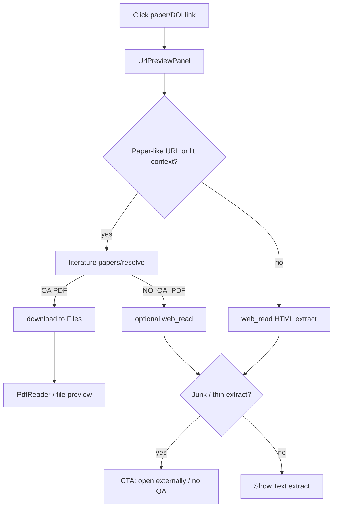

# fix: Paper URL Preview prefers OA PDF over References-only HTML

**Target repos:** `chat-llm-christmas` (this repo) + `chat-api` (sibling; paths under Implementation Units note which repo).

## Goal Capsule

When a user opens a paper/DOI link in URL Preview, do not leave them with a References-only HTML shell. Prefer an open-access PDF (or honest open metadata) via the existing literature resolve/download path; if neither HTML body nor OA PDF is available, show a clear CTA (open externally / no open PDF) instead of junk extract.

**Stop when:** Nature/DOI-class previews either show usable OA PDF (Files/`PdfReader` or extract text from PDF) or an explicit “no open full text” state; ordinary non-paper URLs keep today’s web_read extract behavior; HTML page images are not OCR’d; unit tests cover junk-detect, OA resolve handoff, and CTA.

**Authority:** session-settled — user chose **Strategy A** (prefer OA PDF / open body; CTA when HTML fails) and **excluded** HTML-image OCR this round. Web extract and document extract remain separate pipelines (handoff only).

---

## Product Contract

### Summary

URL Preview defaults to Text extract via `/api/web-read` → chat-api `web_read`. Publisher pages (e.g. Nature via doi.org) often expose paywalled HTML where the only long text block is References; `MIN_EXTRACT_CHARS` still accepts that as success. Literature already knows how to resolve OA PDFs (`resolvePaperDownload`, OpenAlex/S2 `pdfUrl`, arXiv) and download into Files — Preview never calls that path today.

### Problem Frame

- **False-success extract.** Paywalled HTML yields References (and chrome); the panel treats it as a successful article.
- **Wrong pipeline for papers.** Paper links need literature OA resolution, not a harder HTML scrape.
- **Pipelines stay separate.** `web_read` (HTML) and `file_read` (bytes/OCR) must not merge engines; OA PDF may hand off into Files/`PdfReader` / existing PDF text helpers.

### Requirements

- R1. Detect “thin / References-dominated / paywall-shell” extracts so they are not presented as successful full text.
- R2. For likely paper/DOI/publisher URLs (and when the open context already has a literature id), attempt OA PDF resolution before or instead of trusting HTML extract.
- R3. When an OA PDF URL resolves: open it via the existing Files preview path (download-to-user-file → `PdfReader`) **or** show PDF-derived text in Text — pick one primary UX in KTDs; do not invent a third reader.
- R4. When HTML is junk and no OA PDF exists: show an actionable CTA (open in browser; optional “no open-access PDF”) — never dump References as the main body.
- R5. Non-paper URLs keep current `web_read` + embed degrade behavior (see prior URL Preview plans).
- R6. No HTML `` OCR / vision for webpage extract this round.
- R7. PDF fetch used by preview handoff must honor the same SSRF/private-host gates as `web_read` (align `fetchBinaryToBuffer` or route through a gated helper).

### Scope Boundaries

**In scope:** junk/thin extract detection; paper/DOI-aware Preview branch; reuse `papers/resolve` / `resolvePaperDownload` / download-to-Files; CTA UX + i18n EN/ZH; SSRF alignment for PDF fetch; tests in both repos.

**Out of scope:** HTML image OCR/description; publisher cookie/login forwarding; merging web_read and file_read into one engine; full Readability rewrite for all sites; bypassing paywalls.

### Deferred to Follow-Up Work

- Stronger generic HTML article extraction (Readability-class) for non-paper news sites.
- Optional: surface abstract-only from OpenAlex/S2 in Text when PDF is absent (metadata panel).
- Auth-gate host list expansion for major publishers (Nature, Elsevier, etc.) as a soft signal alongside junk detection.

### Actors / Flows

- A1. Chat user clicking a paper title/DOI in literature markdown.
- A2. Chat user pasting an arbitrary URL into Preview.
- F1. Paper URL + OA PDF → Files PDF preview (or PDF text in Text).
- F2. Paper URL + no OA + junk HTML → CTA, not References blob.
- F3. Normal blog URL → unchanged extract/embed path.

### Acceptance Examples

- AE1. Preview `https://doi.org/10.1038/s41575-025-01108-1` (or the resolved Nature URL): user does **not** see a References-only list as “the article”; either OA PDF / open text or a clear no-full-text CTA.
- AE2. Preview an arXiv abs/pdf link: lands on PDF preview or PDF text without requiring a second manual `/papers download`.
- AE3. Preview a normal public blog: extract/embed behavior unchanged from today.
- AE4. HTML extract that is mostly “References” + PubMed/Google Scholar link farms is classified as junk and not shown as success body.

---

## Planning Contract

### Key Technical Decisions

- KTD1. **Do not merge web and file extract engines.** `(session-settled: user-approved — chosen over unified extract engine: pipelines stay independent; only handoff OA PDF into Files/PDF helpers.)` Web = HTML providers + cleaners; Files = anydoc/unpdf/OCR.
- KTD2. **Strategy A primary path for papers.** `(session-settled: user-directed — chosen over HTML-first scrape: prefer OA PDF / open body; CTA when neither works.)`
- KTD3. **Junk detection is heuristic, not publisher-login.** Classify extract as junk when it fails minimum prose quality (e.g. high ratio of citation/reference markers, link-farm density, very low unique paragraph count vs length). Reuse ideas from `cleanContent.js` / client `url-extract-clean.ts` rather than maintaining a huge publisher allowlist. Optional soft signal: DOI host / known publisher hostname.
- KTD4. **Preview handoff UX: download-to-Files → `PdfReader` as primary.** Reuse `POST .../literature/papers/download` (or resolve + existing download turn) so the user gets the same PDF card/preview as `/papers download`. Alternative considered: only inject `readPdfUrl` text into extract mode — cheaper but weaker (no page navigation, no download persistence). Prefer Files preview for parity with literature download; optional secondary: show short PDF text while download completes.
  - **Superseded for Preview (2026-08-08):** session Option 1 + plan `2026-08-08-005-feat-paper-ephemeral-preview-dedupe-plan.md` — Preview opens ephemeral OA PDF via `papers/content` (no Files write). Explicit `/papers download` remains the persist path (with `source_key` dedupe).
- KTD5. **Trigger OA path when** URL looks like DOI/publisher/arXiv **or** Preview was opened from a literature hit that already carries `paperId`/`pdfUrl` (pass optional context into `openUrlPreview` if cheap; otherwise resolve from URL alone via chat-api).
- KTD6. **HTML image OCR: out.** `(session-settled: user-directed — chosen over webpage vision this round.)`
- KTD7. **`web_read` PDF URL gap.** Align tool/preview so direct `.pdf` URLs use `readPdfUrl` (already used by research `readPage`) instead of HTML extract — small shared fix, benefits agents and Preview.

### Assumptions

- OpenAlex/S2 OA fields and existing `resolvePaperDownload` cover enough of the papers users click from `/papers` results; remaining paywalled works correctly get CTA.
- Users accept a short “resolving open PDF…” state before Files preview opens.
- Plan artifact lives in christmas `docs/plans/`; chat-api changes ship via that repo’s usual PR/deploy.

### High-Level Technical Design

### Product Contract preservation

Product Contract created in this bootstrap run (no upstream brainstorm). Session-settled scope: Strategy A + no HTML image OCR.

---

## Implementation Units

### U1. chat-api: classify thin / References-junk extracts

- **Goal:** Shared helper returns whether cleaned extract is usable article body vs junk shell.
- **Requirements:** R1, R4, AE4
- **Dependencies:** none
- **Files:**
  - `chat-api/src/services/tools/cleanContent.js` (or new small module imported by it / `webRead.js`)
  - `chat-api/tests/web-read-clean.test.js` (extend)
- **Approach:**
  1. After `cleanWebReadContent`, score junk signals (reference-section headings, dense “et al.” / year citation lines, PubMed/Scholar-only link clusters, low paragraph diversity).
  2. Expose boolean/reason on `web_read` response (e.g. `quality: 'ok' | 'thin'`) so clients can CTA without re-implementing heuristics — keep heuristic conservative to avoid false junk on real short notes.
- **Test scenarios:**
  - References-heavy Nature-like fixture → thin/junk.
  - Normal blog markdown fixture → ok.
  - Short but legitimate abstract-only page → document expected class (ok vs thin) so implementers do not flip-flop.

### U2. chat-api: paper/DOI resolve endpoint reuse + PDF `web_read` path

- **Goal:** Preview/agent can resolve OA PDF for a DOI/OpenAlex/S2/arXiv URL; direct PDF URLs use `readPdfUrl` inside `web_read`.
- **Requirements:** R2, R3, R7, AE1, AE2
- **Dependencies:** U1 helpful but not required
- **Files:**
  - `chat-api/src/services/research/paperDownload.js`
  - `chat-api/src/routes/literature.js` (confirm `papers/resolve` shape)
  - `chat-api/src/services/tools/webRead.js`
  - `chat-api/src/services/tools/url.js` / binary fetch SSRF alignment
  - `chat-api/tests/literature.test.js`
  - `chat-api/tests/tools.test.js` or PDF text tests
- **Approach:**
  1. Ensure resolve accepts DOI URL / `DOI:…` / W-id / arXiv forms already used by download.
  2. Wire `web_read` early exit: `looksLikePdfUrl` → `readPdfUrl` (parity with research `readPage`).
  3. Gate PDF binary fetch with same private-host rules as `web_read`.
- **Test scenarios:**
  - `web_read` on `https://arxiv.org/pdf/….pdf` returns text, not HTML viewer chrome.
  - Resolve DOI with known OA → pdf URL; without OA → `NO_OA_PDF`.
  - SSRF: private IP PDF URL rejected.

### U3. christmas: UrlPreviewPanel paper-aware orchestration

- **Goal:** On paper-like URLs, try OA resolve/download before trusting HTML extract; show CTA on junk/no-OA.
- **Requirements:** R2–R5, AE1–AE3
- **Dependencies:** U1, U2
- **Files:**
  - `components/chat/panels/UrlPreviewPanel.tsx`
  - `lib/files/url-preview.ts` (paper-like URL helper; optional extend auth-gate list as soft signal only)
  - `lib/files/url-extract-clean.ts` (optional client mirror of thin check)
  - `lib/chat/turn/literature-search.ts` / download helpers (reuse `requestPaperDownload` / resolve client)
  - `app/api/literature/papers/...` proxies as needed
  - i18n message catalogs for CTA strings
  - `tests/files/url-preview.test.ts`
  - `tests/chat/url-extract-clean.test.ts` (if client junk mirror)
- **Approach:**
  1. Detect paper-like URL (doi.org, nature.com, arxiv.org, openalex.org/W…, etc.) centrally in `url-preview.ts`.
  2. Sequence: resolve OA → if pdf, trigger existing download-to-Files and switch preview target to that file (or open file preview alongside); if no OA, run web_read; if `quality=thin` or client junk, show CTA.
  3. Pass through non-paper URLs unchanged.
- **Execution note:** Prefer characterization tests around mode transitions before expanding panel state machine.
- **Test scenarios:**
  - Paper-like URL + mocked OA resolve → preview navigates to file/PDF path (mock download).
  - Paper-like URL + NO_OA + thin extract → CTA visible, extract body not shown as success.
  - Non-paper URL → still calls web_read only.

### U4. christmas: optional literature context on openUrlPreview

- **Goal:** When the click originates from a literature hit that already has `pdfUrl`/`paperId`, skip redundant guessing.
- **Requirements:** R2, AE2
- **Dependencies:** U3
- **Files:**
  - `components/chat-container.tsx` (`openUrlPreview`)
  - `components/chat/message/AnswerMarkdown.tsx` / message list wiring (only if low-cost context pass-through)
  - `tests/chat/literature-command.test.ts` (if command/url helpers change)
- **Approach:** Extend preview target with optional `{ paperId?, pdfUrl? }` when known; Panel prefers that over URL heuristics. If wiring is invasive, ship U3 URL-only first and keep this unit thin or merge into U3.
- **Test scenarios:**
  - Preview open with `pdfUrl` set → resolve/download uses that id/url without DOI scrape.
  - Missing context → falls back to U3 URL heuristics.

### U5. Docs + deploy notes

- **Goal:** Document pipeline split and Preview paper behavior for operators.
- **Requirements:** R5, R6
- **Dependencies:** U3
- **Files:**
  - `lib/files/README.md` and/or `docs/images-and-files.md` (christmas)
  - short note in chat-api literature/web_read README if present
- **Test expectation:** none — docs only.
- **Verification:** README states web vs file separation; HTML OCR explicitly out of Preview extract.

---

## Verification Contract

- christmas: `npx vitest run tests/files/url-preview.test.ts tests/chat/url-extract-clean.test.ts` (plus any new panel/literature tests added).
- chat-api: `node --test tests/web-read-clean.test.js tests/literature.test.js` (and PDF/`tools` tests touched).
- Manual: AE1 Nature/DOI Preview; AE2 arXiv; AE3 normal blog; confirm no HTML image OCR work landed.

## Definition of Done

- Junk HTML extracts are not shown as successful paper full text.
- OA PDF path reuses literature resolve/download + Files preview.
- CTA covers no-OA + junk cases.
- SSRF aligned for PDF fetch used by handoff.
- HTML webpage image OCR not introduced.
- Both repos tested; chat-api deployed if API surface changes.

## Risks & Dependencies

- **False junk:** over-aggressive heuristics could CTA on short legitimate pages — keep conservative + fixtures.
- **Download UX latency:** PDF fetch ≤20MB; show progress; do not block forever.
- **Publisher hostility:** some “PDF” URLs return HTML landing pages — existing `DOWNLOAD_HTML` / sniff must surface as CTA, not corrupt Files.
- **Depends on:** prior URL Preview extract-clean plans; literature OpenAlex mailto/details already on main.

## Open Questions

- **Deferred:** Whether Text mode should also show OpenAlex abstract when PDF is missing (metadata panel) — nice-to-have, not blocking.
- **Deferred:** Expanding `isLikelyAuthGatedPreviewUrl` with publisher hosts as a parallel UX cue.

## Sources & Research

- Local: `components/chat/panels/UrlPreviewPanel.tsx`, `lib/files/url-preview.ts`, `app/api/web-read/route.ts`, chat-api `src/services/tools/webRead.js`, `extract.js`, `cleanContent.js`, `src/services/research/paperDownload.js`.
- Prior plans: `docs/plans/2026-08-06-006-fix-url-preview-embed-detect-extract-clean-plan.md`, `docs/plans/2026-08-07-007-fix-url-preview-extract-link-navigate-plan.md`.
- External research: skipped — strong local patterns for Preview + literature download.
