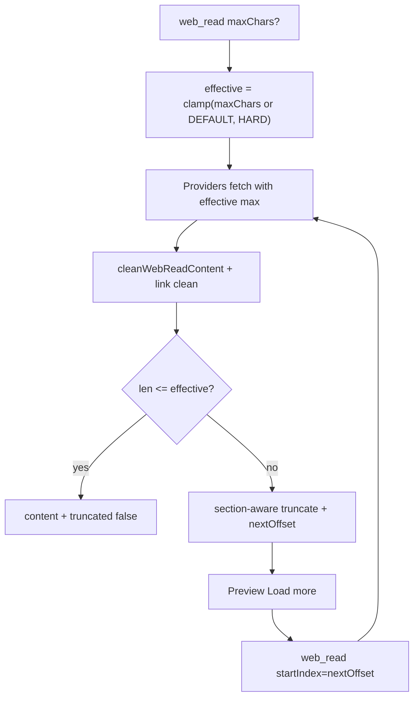

# feat: Adaptive web extract length + clean about: citation links

**Target repos:** `chat-llm-christmas` (this repo) + `chat-api` (sibling; paths under Implementation Units note which repo).

## Goal Capsule

Make URL Preview / `web_read` long-article extracts **adaptive in length** (return the full cleaned body when it fits under a hard safety ceiling; only truncate when necessary, at section-friendly boundaries) and support **continue / load-more** when truncated. Clean Nature-style `about:` / useless hash citation links to readable footnote numbers. Do **not** OCR HTML figures or restore table bodies this round.

**Stop when:** Preview of a long OA HTML article (e.g. Nature via doi.org) either shows the full cleaned prose under the hard ceiling, or shows a clear truncated marker + working continue control; `about:` citation markdown no longer appears as unusable links; agent `web_read` still has a sensible default soft budget; unit tests cover truncate metadata, continue offset, and link cleaning.

**Authority:** session-settled — user chose truncation direction **A refined to adaptive** (raise usable length + continue when needed; prefer adaptive fit over a fixed 48k preview cut) and dirty-link scope **2A** (strip `about:` / useless hash refs, keep readable footnote numbers). Charts/table OCR remain out (PDF / `file_read` path).

---

## Product Contract

### Summary

After paper Preview Strategy A, Nature/DOI HTML can already yield real article body, but users still hit a hard mid-article cut around **48k** (provider + server clamp), with dirty `[n](about:/…#ref-CRn …)` citation links. Preview already requests `maxChars: 80_000` while chat-api Fetch MCP clamps `max_length` to `MAX_CONTENT_CHARS` (48_000), so the client ask is ignored. Truncation must become **content-adaptive under a hard ceiling**, with continue when the ceiling still binds.

### Problem Frame

- **False fixed cut.** Short pages should return fully; long pages should not be cut at an arbitrary 48k merely because that is the agent default.
- **Hard ceiling still required.** Unbounded extract risks memory, provider timeouts, JSON payload size, and Preview UI stall — a safety ceiling remains (align with christmas proxy clamp **200_000**).
- **Provider already hints pagination.** Fetch MCP returns prose like `Content truncated. Call the fetch tool with a start_index of 48000` — continue should reuse that protocol rather than inventing a second store.
- **Dirty citation chrome.** Nature-style `about:` / page-local hash refs pollute Text mode; readers only need footnote numbers.

### Requirements

- R1. **Adaptive fit:** If cleaned extract length ≤ effective `maxChars` (caller request clamped to hard ceiling), return the full body with `truncated: false` — no artificial lower default for Preview when Preview asks higher.
- R2. **Hard ceiling:** Enforce a single documented hard max (recommend **200_000**, matching `app/api/web-read/route.ts`). Reject or clamp requests above it.
- R3. **Soft default for agents:** Keep a lower **default** when `maxChars` omitted (today’s ~48k is fine as agent soft budget so tool results do not flood context). Preview / explicit callers may raise up to the hard ceiling.
- R4. **Friendly truncate:** When over effective max, prefer cutting at a nearby markdown heading / blank-line paragraph boundary; append a stable truncated marker; expose machine fields (`truncated`, `nextOffset` / `startIndex`, optional `totalChars` if cheap).
- R5. **Continue / load-more:** Preview shows a control when `truncated`; next request passes `startIndex` (or equivalent) and appends the next chunk. Prefer wiring Fetch MCP `start_index` when that provider produced the body; for other providers, slice from retained full cleaned text only if already in-process — do **not** require a durable server-side extract cache in v1 (re-fetch + offset is OK).
- R6. **Dirty link clean (2A):** In `cleanWebReadContent` (and client belt `cleanUrlExtractText`), rewrite `about:` / useless hash-only citation links to readable footnote numbers (e.g. `[15](about:…)` → `15` or `[15]`); keep real `https://` citations. Idempotent; do not destroy prose.
- R7. **No HTML table/figure OCR** this round; empty “Full size table” placeholders may remain (optional follow-up 2B).
- R8. Non-Preview agent `web_read` behavior stays safe: default soft budget unchanged unless caller passes higher `maxChars`.

### Scope Boundaries

**In scope:** Adaptive truncate + hard ceiling; fix Fetch MCP `max_length` clamp bug; continue metadata + Preview UX; `about:` / hash citation cleaning; tests both repos.

**Out of scope:** HTML image OCR; reconstructing table cells from images; merging web_read into file_read; durable extract cache / Redis; raising agent default soft budget globally without caller opt-in.

### Deferred to Follow-Up Work

- 2B: drop “Full size table” / empty fig placeholder lines.
- Prefer OA PDF in Files automatically when HTML would need multiple continue pages (Strategy C hybrid).
- Durable server-side extract cache keyed by URL+etag for cheaper continue.

### Actors / Flows

- A1. Chat user opening a long paper/HTML URL in Preview.
- A2. Agent calling `web_read` without `maxChars` (soft default).
- F1. Short article → full body, no continue UI.
- F2. Long article under hard ceiling → full body in one response when Preview asks high enough.
- F3. Article above hard ceiling (or provider page size) → truncated + continue loads next chunk.
- F4. Nature citation chrome → cleaned footnote numbers in Text.

### Acceptance Examples

- AE1. Preview `https://doi.org/10.1038/s43856-025-01194-x` (or equivalent OA HTML): either full Introduction→Results→Discussion under hard ceiling, or truncated with working **Load more** that continues past the first cut (no stuck 48k wall while Preview asked 80k+).
- AE2. Same extract: no `[15](about:/articles/…#ref-CR15 …)` blobs; superscript/footnote numbers remain readable.
- AE3. Agent `web_read` without `maxChars` still defaults to soft ~48k (or documented successor), so tool context does not silently jump to 200k.
- AE4. Normal short blog unchanged (full body, no continue).

---

## Planning Contract

### Key Technical Decisions

- **KTD1. Adaptive ≠ unbounded.** `(session-settled: user asked for adaptive; hard ceiling retained for safety.)` Soft default (agent) + hard ceiling (all callers) + return-all-when-fits. Preview raises request toward hard ceiling; does not remove the ceiling.
- **KTD2. Fix the 48k Preview lie.** Remove `Math.min(maxChars, MAX_CONTENT_CHARS)` on Fetch MCP `max_length` (use effective max / hard ceiling). Today Preview’s 80k is ignored — that is the immediate bug behind the Nature cut.
- **KTD3. Two constants.** Rename/clarify: `DEFAULT_CONTENT_CHARS` (soft, ~48k) vs `HARD_MAX_CONTENT_CHARS` (200k). `truncateContent` / `webRead` use caller `maxChars || DEFAULT`, clamped to `HARD_MAX`.
- **KTD4. Continue via offset, not a second product mode.** Response: `truncated`, `nextOffset` (char index into logical full extract). Preview appends. When Fetch MCP emits `start_index`, map that into `nextOffset` / pass through on continue. v1 may re-fetch; durable cache deferred.
- **KTD5. Section-aware cut is best-effort.** Look back a small window (e.g. last 800 chars) for `\n## ` / `\n\n`; if none, hard slice. Do not rewrite the whole document.
- **KTD6. Link cleaning in server cleaner first.** Extend `cleanContent.js`; mirror minimal rules in christmas `url-extract-clean.ts` for stale-API belt. Pattern: markdown links whose destination is `about:` or `#…` only (optional: strip title-attr citation dumps) → keep label text as footnote.
- **KTD7. Charts stay empty.** No 2B / OCR in this plan.

### Assumptions

- Most OA HTML papers that Preview cares about fit under 200k cleaned chars once the 48k clamp is fixed; continue is for the long tail / provider page limits.
- Re-fetch on continue is acceptable latency for Preview v1.
- Footnote numbers without hyperlinks are acceptable UX for Preview Text mode.

### High-Level Technical Design



### Product Contract preservation

Product Contract created in this bootstrap run. Session-settled: adaptive truncation under hard ceiling + continue; dirty-link clean 2A; no HTML OCR.

---

## Implementation Units

### U1. chat-api: DEFAULT vs HARD max + Fix Fetch MCP clamp + truncate metadata

- **Goal:** Callers can request up to hard ceiling; Fetch MCP no longer silently caps at 48k; responses advertise truncation.
- **Requirements:** R1–R4, R8, AE1, AE3
- **Dependencies:** none
- **Files:**
  - `chat-api/src/services/tools/types.js`
  - `chat-api/src/services/tools/webRead.js`
  - `chat-api/src/routes/tools.js`
  - `chat-api/tests/tools.test.js` (or new truncate helper tests)
- **Approach:**
  1. Split `DEFAULT_CONTENT_CHARS` / `HARD_MAX_CONTENT_CHARS`; `effectiveMaxChars(requested)`.
  2. `truncateContent` returns `{ text, truncated, nextOffset }` (or parallel helpers) with section-aware backtrack.
  3. Fix `readFetchMcp` `max_length` to use effective max (not `min(., MAX_CONTENT_CHARS)`). Parse provider “start_index of N” into `nextOffset` when present.
  4. Route JSON adds `truncated`, `nextOffset` (and optional `startIndex` alias).
- **Test scenarios:**
  - Request omitted → soft default length.
  - Request 80_000 → content may exceed 48k (fixture/stub provider).
  - Request 500_000 → clamped to HARD.
  - Over-limit body → `truncated: true` and `nextOffset > 0`; under-limit → `truncated: false`.

### U2. chat-api: continue / startIndex on web_read

- **Goal:** Second call returns the next chunk for Preview append.
- **Requirements:** R5, AE1
- **Dependencies:** U1
- **Files:**
  - `chat-api/src/services/tools/webRead.js`
  - `chat-api/src/routes/tools.js`
  - tests as in U1
- **Approach:**
  1. Accept `startIndex` / `start_index` on `/web_read`.
  2. Pass through to Fetch MCP when that provider is used; for bare-fetch / Jina paths, fetch full (within hard max of what provider returns) then slice from offset after clean — document if some providers cannot seek (return error or restart-from-0 with note).
  3. Keep cleaning idempotent on each chunk; avoid double-stripping headers mid-document on continue (skip provider-header strip when `startIndex > 0`).
- **Test scenarios:**
  - `startIndex: 0` ≡ first page.
  - Continue stub: second call content does not duplicate first chunk prefix.
  - `startIndex > 0` does not strip a mid-body `Title:` line as provider header.

### U3. chat-api + christmas: clean about: / hash citation links

- **Goal:** Readable footnotes; no `about:` destinations in Preview Text.
- **Requirements:** R6, AE2
- **Dependencies:** none (can parallel U1)
- **Files:**
  - `chat-api/src/services/tools/cleanContent.js`
  - `chat-api/tests/web-read-clean.test.js`
  - `lib/files/url-extract-clean.ts`
  - `tests/chat/url-extract-clean.test.ts`
- **Approach:**
  1. Line/global markdown-link rewrite: if href is `about:…` or `#…` (and optionally empty), replace with label text (prefer numeric labels → bare `15` or `[15]` — pick one and lock in tests).
  2. Do not alter fenced code; do not touch normal http(s) links.
  3. Mirror on client cleaner for belt-and-suspenders.
- **Test scenarios:**
  - Nature-like `[15](about:/articles/x#ref-CR15 "…")` → cleaned footnote form.
  - `[paper](https://doi.org/…)` unchanged.
  - Idempotent second pass.

### U4. christmas: Preview request budget + Load more UX

- **Goal:** Preview asks up to hard ceiling; shows continue when truncated.
- **Requirements:** R1, R5, AE1, AE4
- **Dependencies:** U1, U2, U3
- **Files:**
  - `components/chat/panels/UrlPreviewPanel.tsx`
  - `app/api/web-read/route.ts` (confirm 200k clamp; pass `startIndex`)
  - i18n strings EN/ZH for “Load more” / truncated notice
  - `tests/files/url-preview.test.ts` or panel-focused test if present
- **Approach:**
  1. Raise Preview `maxChars` toward hard ceiling (e.g. 200_000 or 160_000) — not stuck at 80k if hard allows.
  2. On `truncated`, show control; call again with `startIndex: nextOffset`; append content (dedupe marker lines).
  3. Keep thin/OA paper path from plan 001 intact — this unit only affects successful text extracts.
- **Test scenarios:**
  - Mock truncated response → Load more visible; second mock appends.
  - Mock full short body → no Load more.
  - Paper thin/CTA path unchanged (smoke / existing tests).

### U5. Docs touch + verify

- **Goal:** Document the soft/hard distinction so future callers do not reintroduce a silent 48k clamp.
- **Requirements:** R2, R3
- **Dependencies:** U1–U4
- **Files:**
  - `lib/files/README.md` and/or chat-api tools comment near constants
  - Brief note in prior paper preview plan deferred section (optional one-liner)
- **Test scenarios:** manual smoke AE1–AE2 on the Nature DOI after chat-api deploy.

---

## Dependency Graph

```text
U3 (link clean) ──────────────┐
U1 (adaptive max + metadata) ─┼─► U2 (continue) ─► U4 (Preview UX) ─► U5
```

## Risks and Edge Cases

- **Provider page size < hard ceiling:** Continue still needed; must honor provider `start_index`.
- **Double header strip on continue:** Guard with `startIndex > 0`.
- **Agent token blowups:** Do not raise DEFAULT for agents; only Preview/explicit `maxChars`.
- **Append seams:** Truncation marker lines should be stripped when appending the next chunk.

## Definition of Done

- [ ] Soft default vs hard ceiling documented and enforced
- [ ] Fetch MCP no longer clamps Preview below requested effective max
- [ ] Truncation metadata + Preview Load more work on a long fixture
- [ ] `about:` citation links cleaned (server + client tests)
- [ ] Agent default soft budget unchanged
- [ ] No HTML OCR / table body restoration shipped

## Execution Direction

Characterization-first for truncate helpers and cleaners; then Preview wiring; smoke the Nature DOI against a deployed chat-api.
