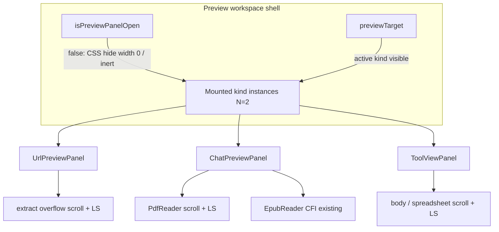

## Goal Capsule

Make the side Preview a durable workspace surface: closing the panel or switching between webpage / file / tool-view must not kill in-flight loads or wipe reading position; conversation switches already keep the target (PR #57/#58). Reading positions for PDF, text, URL extract, Tool view, and spreadsheets persist like EPUB (`localStorage`).

**Authority:** conversation audit + this plan. Session-settled: workspace-level Preview; full package (scroll + keep-mounted + PDF progress).

**Stop when:** close/kind-switch no longer aborts active loads; scroll/CFI-class positions restore after remount/refresh for in-scope surfaces; memory bounded (active + one previous kind).

---

## Product Contract

### Summary

Users open a webpage or file in Preview, then start a new chat to discuss it — or briefly close the panel / open another kind — without losing load progress or where they were reading. EPUB already remembers CFI; this work extends that durability to the rest of Preview and stops unmount-on-close from cancelling fetches.

### Requirements

- **R1.** Closing Preview (chrome hide) must not abort in-flight URL extract, file extract/text fetch, PDF parse, or EPUB download for the current target.
- **R2.** Switching Preview kind (url ↔ file ↔ view) must keep the previous kind’s instance alive (hidden) so returning restores live state without cold reload, within a small LRU bound.
- **R3.** Conversation switches must continue to keep `previewTarget` and in-flight work (already shipped; do not regress #57/#58).
- **R4.** Reading position persists across remount and browser refresh for: URL extract scroll, PDF scroll (and/or page offset), text/markdown/sidecar body scroll, Tool view body scroll, spreadsheet outer scroll. EPUB keeps using existing CFI prefs.
- **R5.** URL Embed iframe scroll is best-effort keep-mounted only — no cross-origin scroll persist.
- **R6.** Deleting an account file clears related progress keys (same path as `clearEpubReaderPrefs`).
- **R7.** Empty Paste (no target) and opening a *different* URL/file still resets that target’s load as today.

### Actors

- **A1.** Chat user using side Preview while multi-tasking across conversations.

### Key Flows

- **F1.** Load slow URL extract → close panel → reopen → still loading or finished in place.
- **F2.** Scroll PDF mid-document → switch to URL Preview → return to file → same scroll (live instance or localStorage restore).
- **F3.** Scroll URL extract → new conversation → scroll and content unchanged.
- **F4.** Refresh browser with Preview closed → reopen same file → PDF/text scroll restored from localStorage; EPUB CFI unchanged path.

### Acceptance Examples

- **AE1.** Covers F1 / R1: Mid-extract, close Preview chrome; network continues; reopen shows progress/result without restarting from scratch.
- **AE2.** Covers F2 / R2+R4: PDF scrolled → open webpage → back to PDF → position preserved.
- **AE3.** Covers F3 / R3: Sticky across session switch with extract still loading (no abort regression).
- **AE4.** Covers F4 / R4: After hard refresh, reopen PDF by same `fileId` restores prior `scrollTop` (or equivalent).

### Scope Boundaries

**In scope:** Side Preview panels + PdfReader scroll prefs + shared progress helper + container/hook mount topology.

**Deferred to Follow-Up Work:** Fullscreen `FilePreviewOverlay` lifecycle parity; cloud-synced reading positions; multi-tab live sync of scroll.

**Out of scope:** Cookie-proxy for Embed; merging web/file extract engines; changing Quote/iframe security model.

### Key Decisions (product)

- Preview is workspace chrome, not per-conversation UI — `Governs R3`.
- Close means hide, not destroy — `Governs R1`.
- Positions survive refresh via localStorage like EPUB — `Governs R4`.

---

## Planning Contract

### Assumptions

- User confirmed scope with “继续”; call-out defaults applied: **keep-mounted (CSS hide)** over remount+cache-only; **localStorage** for positions; **include** Tool view + spreadsheet scroll.
- At most **active + one previous kind** instance retained (N=2); further switches LRU-evict the older hidden instance (progress still recoverable from localStorage where applicable).
- Cross-session same `fileId`/`url` shares one progress key (EPUB precedent).

### Key Technical Decisions

- **KTD1.** Keep-mounted visibility contract `(session-settled: user-approved — chosen over remount+cache-only: in-flight network and hot PDF/EPUB instances cannot be restored from localStorage alone)`. `open` controls CSS/`inert`/width chrome only; fetch/abort effects must not treat `open===false` as cancel. Abort only on target identity change, unmount/LRU eviction, or explicit navigate-away.
- **KTD2.** Kind keep-alive `(session-settled: user-approved — chosen over single ternary remount)`. Replace exclusive ternary with a small registry of mounted kind instances (active visible; previous hidden). EmptyPaste only when no `previewTarget`.
- **KTD3.** Progress SSOT in `lib/files/preview-progress.ts` mirroring `epub-progress.ts` (versioned keys, try/catch quota, SSR-safe). Keep `epub-progress.ts` for CFI+fonts; do not fold EPUB into the generic helper.
- **KTD4.** Orchestration in `hooks/chat/use-preview-workspace.ts` (or equivalent) — container stays wiring-only per `docs/code-organization.md`.
- **KTD5.** Unstable parent callbacks stay on refs in panel effects (extend #58 discipline); do not reintroduce `onOpenDownloadedFile`/`t` as abort deps.

### High-Level Technical Design

Visibility vs abort:

| Event | Visibility | Abort in-flight? | Progress |
|-------|------------|------------------|----------|
| Close panel | Hide | No | Debounced save |
| Kind switch | Hide previous | No (until LRU) | Save previous |
| New URL/file id | Remount that slot | Yes for old id | New key |
| Delete file | Drop instance | Yes | `clear*` |
| Session switch | Unchanged | No | Unchanged |

### Product Contract preservation

Product Contract authored in this bootstrap run — no upstream brainstorm file.

### Risks

- **Memory:** pdf.js + EPUB blob + iframe held while hidden — mitigate with N=2 LRU.
- **Layout:** `display:none` may stall ResizeObserver / epub width — prefer `inert` + zero width / `visibility` aligned with existing width animation.
- **Iframe:** cross-origin scroll not readable — document as R5, rely on keep-mounted.

### Alternatives Considered

- **Remount + result cache only** — lighter memory; cannot preserve true in-flight fetch or hot reader instances. Rejected as primary (KTD1).
- **sessionStorage only** — loses refresh restore users expect from EPUB parity. Rejected for positions (KTD3).

---

## Implementation Units

### U1. Shared preview progress helper

**Goal:** Versioned localStorage load/save/clear for scroll (and optional PDF page metadata) keyed by surface + id.

**Requirements:** R4, R6

**Dependencies:** None

**Files:**
- `lib/files/preview-progress.ts` (create)
- `tests/files/preview-progress.test.ts` (create)
- `lib/files/README.md` (modify — register helper + note `epub-progress`)

**Approach:**
1. Mirror `epub-progress.ts` API shape: `loadPreviewScroll` / `savePreviewScroll` / `clearPreviewScroll` with keys like `preview-scroll:v1:{surface}:{id}`.
2. Surfaces: `url` | `file` | `pdf` | `tool` | `sheet` (exact enum in impl).
3. Payload: `{ scrollTop, scrollLeft?, page?, updatedAt }` — ignore corrupt JSON.
4. Wire clear into existing delete-file scrub path alongside `clearEpubReaderPrefs`.

**Patterns to follow:** `lib/files/epub-progress.ts`, `tests/files/epub-progress.test.ts`

**Test scenarios:**
- Round-trip save/load for a file id
- Missing key → null
- Corrupt JSON → null
- clear removes key
- SSR / no window → no-op / null

**Verification:** Unit tests green; README lists the module.

---

### U2. Panel visibility without abort-on-close

**Goal:** Closing Preview hides chrome but does not reset/abort active loads.

**Requirements:** R1, R7

**Dependencies:** None (can parallel U1)

**Files:**
- `components/chat/panels/UrlPreviewPanel.tsx` (incl. EmptyPaste shell)
- `components/chat/panels/ChatPreviewPanel.tsx`
- `components/chat/panels/ToolViewPanel.tsx`

**Approach:**
1. Change `{open && <motion...>}` so the panel instance stays mounted when `open` flips false (animate width to 0 / hide), or lift AnimatePresence to an outer shell that does not unmount children.
2. Remove `!open` early-abort/reset from ChatPreviewPanel fetch effect; gate *starting* a new load on having a file+needsAsyncLoad, not on open.
3. UrlPreviewPanel: keep extract/prefetch running when `open` is false; abort only on `url`/`mode`/`extractRetryNonce` (already mostly true after #58 — drop `open` from abort-critical path).
4. Preserve hard reset on `url` / `file.id` change.

**Patterns to follow:** #58 callback-ref discipline; width helper `panel-widths.ts`

**Test scenarios:**
- Test expectation: prefer pure helpers if extracted (e.g. `shouldAbortPreviewLoad({ open, targetChanged })`); otherwise manual AE1. Optional unit for abort-gate pure function in `tests/chat/`.

**Verification:** Manual AE1; no abort when toggling open with stable url/file id.

---

### U3. Kind keep-alive registry

**Goal:** Switching url ↔ file ↔ view keeps previous instance mounted (hidden) within N=2.

**Requirements:** R2, R3

**Dependencies:** U2

**Files:**
- `hooks/chat/use-preview-workspace.ts` (create)
- `components/chat-container.tsx` (wire; thin)
- optionally thin presentational wrapper under `components/chat/panels/`

**Approach:**
1. Replace exclusive ternary with rendering of active + previous kind entries from a small registry keyed by kind + target identity.
2. Inactive instances: `aria-hidden` / `inert` / not focusable; do not run competing width expansion (only active contributes layout width).
3. LRU: when a third distinct kind/target would mount, unmount the oldest hidden (progress already flushed in U4).
4. Do not regress owning-session file/view sync or sticky session behavior.

**Patterns to follow:** container wiring-only; sticky preview comments in `chat-container.tsx`

**Test scenarios:**
- Pure registry helper: push active A → switch B → registry has A hidden + B active; switch C → A evicted, B hidden, C active
- Identity change on same kind (new url) replaces that slot and aborts old

**Files (tests):** `tests/chat/preview-workspace-registry.test.ts` (create)

**Verification:** Manual AE2; registry unit tests.

---

### U4. Wire scroll save/restore into readers and panels

**Goal:** Debounced persist + restore for in-scope surfaces.

**Requirements:** R4, R5

**Dependencies:** U1, U2 (restore after keep-mount still useful for refresh)

**Files:**
- `components/files/PdfReader.tsx`
- `components/chat/panels/UrlPreviewPanel.tsx` (extract overflow container)
- `components/chat/panels/ChatPreviewPanel.tsx` (text/spreadsheet body)
- `components/chat/panels/ToolViewPanel.tsx`
- `components/files/SpreadsheetTable.tsx` (optional scrollLeft if outer insufficient)

**Approach:**
1. PDF: on scroll debounce → `savePreviewScroll('pdf', fileId, { scrollTop })`; on doc ready → restore once.
2. URL extract: attach ref to overflow container; key by normalized url.
3. Text/sidecar body: key by `file.id`.
4. Tool view: key by `view.id` (+ `messageId` if needed for uniqueness).
5. Spreadsheet: persist outer panel scrollTop; scrollLeft if cheap on table wrapper.
6. Skip iframe scroll persist (R5).
7. EPUB unchanged.

**Patterns to follow:** EpubReader relocated debounce (~400ms)

**Test scenarios:**
- Pdf restore applies saved scrollTop after load (unit around save payload + restore clamp if extracted)
- Manual AE2/AE4 for PDF and URL extract

**Verification:** AE2, AE4; helpers covered in U1.

---

### U5. Delete scrub + docs touch-up

**Goal:** File delete clears generic progress keys; docs match reality.

**Requirements:** R6

**Dependencies:** U1

**Files:**
- `components/chat-container.tsx` (or owning scrub helper)
- `lib/files/README.md`
- `lib/files/README.md` / `lib/chat/README.md` one-line Preview workspace note if needed

**Approach:** Extend `scrubDeletedAccountFile` (or equivalent) to `clearPreviewScroll` for relevant surfaces when `fileId` deleted.

**Test expectation:** none beyond U1 clear + existing scrub path smoke.

**Verification:** Delete file → corresponding LS keys gone.

---

## Verification Contract

- Unit: `tests/files/preview-progress.test.ts`, `tests/chat/preview-workspace-registry.test.ts`
- Manual: AE1–AE4 on side Preview (URL extract, PDF, session switch, refresh)
- Regression: sticky session (#57) and extract-not-aborted-on-rerender (#58) still hold
- Prefer repo’s existing vitest invocation for touched tests

## Definition of Done

- All U1–U5 complete; R1–R7 satisfied
- No abort-on-close for stable targets; kind switch preserves previous instance within N=2
- Progress keys documented; file delete clears them
- No regression of workspace sticky Preview across conversations

## Appendix

### Sources & Research

- Local patterns: `lib/files/epub-progress.ts`, panels AnimatePresence unmount, `chat-container` sticky Preview, #58 abort-deps fix
- Adjacent plans: URL preview / paper OA / Quote (constraints only) — no `docs/solutions/` corpus
- External research: skipped — strong local EPUB/progress and panel patterns

### Flow gaps closed in plan

- Close-panel abort → KTD1 / U2
- Kind remount → KTD2 / U3
- PDF/text/URL scroll → KTD3 / U4
- Memory bound → Assumption N=2 + U3 LRU
