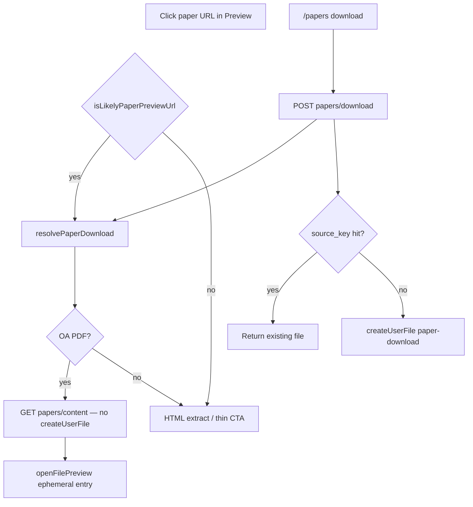

# feat: Ephemeral paper PDF preview + download dedupe

**Target repos:** `chat-llm-christmas` (this repo) + `chat-api` (sibling; paths under Implementation Units note which repo).

**Product Contract preservation:** Product Contract authored here from session-settled Option 1 (preview ≠ download; `/papers download` saves + dedupe). Overrides prior plan `docs/plans/2026-08-08-001-fix-paper-url-preview-oa-pdf-plan.md` **KTD4** (download-to-Files as Preview primary).

## Goal Capsule

Clicking a paper/DOI/publisher title in Preview must open an **online OA PDF** in `PdfReader` without writing Files. Only explicit `/papers download` (or equivalent save action) creates a `paper-download` file, and repeats of the same paper must reuse the existing row.

**Authority:** conversation audit + this plan. Session-settled Option 1; call-out defaults: prefer ephemeral OA PDF when available for Nature HTML pages; bytes via chat-api content path + Next same-origin proxy.

**Stop when:** paper Preview no longer calls `papers/download` / `createUserFile`; OA PDF opens via ephemeral proxy URL; NO_OA falls through to existing HTML extract / thin CTA; explicit download dedupes by stable `source_key`; non-paper Preview unchanged.

---

## Product Contract

### Summary

Today `UrlPreviewPanel` treats paper-like URLs by calling `requestPaperDownload` → `POST /api/literature/papers/download` → `createUserFile({ purpose: 'paper-download' })` → `openFilePreview`. Every click creates another Files row (same Nature article, many IDs). Users expect title-click = online preview; the separate download chip = save.

### Problem Frame

- **Preview silently downloads.** Title/link Preview is product-equivalent to `/papers download`.
- **No dedupe.** Even intentional downloads stack duplicate `paper-download` rows.
- **Prior plan conflict.** Plan 001 KTD4 intentionally chose download-to-Files; this session reverses that product choice for Preview only.

### Requirements

- R1. Paper-like URL Preview with resolvable OA PDF opens `PdfReader` on **ephemeral** bytes (same-origin content proxy). Must **not** call `createUserFile` / write Files.
- R2. When OA PDF cannot be resolved (`NO_OA_PDF` / not PDF): keep existing paper HTML extract + thin/CTA path (plan 001 Strategy A remnants already in panel). Do not invent a third reader.
- R3. Explicit `/papers download` (literature chip / command) remains the only path that persists a paper PDF into Files.
- R4. Explicit download dedupes: same user + same paper identity must return the existing file meta instead of inserting another row.
- R5. Non-paper URL Preview (`web_read` / embed) unchanged.
- R6. PDF byte fetch for preview and download continues to honor existing SSRF / size / sniff gates (`fetchBinaryToBuffer`).
- R7. Ephemeral preview entries must not look like durable Files IDs (`file-*`); Preview chrome Download on ephemeral targets should **Save to Files** (explicit download + dedupe) or be clearly non-destructive — not pretend the file is already stored.
- R8. Workspace Preview durability (plan 004 keep-mounted / scroll) must not regress; ephemeral paper preview uses the file-kind panel like today.

### Actors

- A1. Chat user clicking a literature hit title / DOI / publisher URL expecting online reading.
- A2. Chat user clicking `/papers download` (or Save) expecting a durable Files entry.

### Key Flows

- F1. Click Nature/DOI paper URL with OA PDF → ephemeral `PdfReader`; Files list unchanged.
- F2. Click same paper URL again → still no new Files row; preview reloads or reuses content URL.
- F3. Click `/papers download` twice for same paper → one Files row; second returns existing `fileId`.
- F4. Paper URL with no OA → thin CTA / existing HTML path; no Files write from Preview.
- F5. Normal blog URL Preview → unchanged extract/embed.

### Acceptance Examples

- AE1. Covers F1/R1: Preview `https://doi.org/10.1038/...` (or Nature landing) with OA → PDF pages in side Preview; `listUserFiles` has no new `paper-download` from that click.
- AE2. Covers F2/R1: Three Preview opens of the same DOI → still zero preview-driven Files rows.
- AE3. Covers F3/R3+R4: Two `/papers download` of same DOI → one Files entry; API returns same `file.id`.
- AE4. Covers F4/R2: Paper with `NO_OA_PDF` → CTA / thin message; no Files write.
- AE5. Covers F5/R5: Public blog Preview still extract/embed as today.

### Scope Boundaries

**In scope:** UrlPreview paper branch rewiring; chat-api papers content (no-store) endpoint; Next literature content proxy; Files `source_key` + download dedupe; ephemeral `GeneratedFileEntry` + Preview Save semantics; tests both repos; README note correcting plan-001 Files-primary wording.

**Deferred to Follow-Up Work:** Backfill `source_key` for historical duplicates; cloud-synced reading positions for ephemeral keys; ticket-direct chat-api content (skip Next body) if Vercel timeouts bite large PDFs.

**Out of scope:** Paywall bypass / cookie forwarding; HTML `` OCR; merging `web_read` and `file_read` engines; inventing a third PDF reader; auto-OA-download-to-Files on multi-continue (plan 002 Strategy C — stays deferred and must stay off).

### Key Decisions (product)

- Preview ≠ download — ephemeral OA PDF only — `Governs R1`.
- Only explicit download persists — `Governs R3`.
- Prefer OA PDF over HTML when OA exists (Nature HTML pages) — `Governs R1+R2`.
- Dedupe by stable paper identity, not filename — `Governs R4`.

### Outstanding Questions

- None blocking. Deferred: whether ephemeral Preview chrome uses “Save to Files” label vs hide Download until saved (implementer picks existing i18n patterns; prefer Save-to-Files when cheap).

---

## Planning Contract

### Assumptions

- User confirmed scope with 「后续」; defaults applied: OA-first ephemeral PDF; chat-api content + Next proxy (not browser-direct CORS / pure blob-first).
- Implement on a **new branch from main** in both repos; do not mix with `feat/research-writer-retries-body-count-hint`.
- Plan 001 thin/junk + CTA path already partially shipped; this plan does not re-litigate Strategy A — only reverses KTD4 Files-primary for Preview.
- `PdfReader` + `fetchFileContentForPreview` already support non-`/api/files` same-origin URLs via `fetchViaSameOriginProxy`.

### Key Technical Decisions

- KTD1. **Ephemeral content path** `(session-settled: user-approved — chosen over download-to-Files and over browser-direct PDF)`. chat-api resolves OA URL, fetches bytes with existing gated helper, streams/returns PDF **without** `createUserFile`. Next exposes authenticated same-origin `GET /api/literature/papers/content?identifier=…`. Preview opens `GeneratedFileEntry` with that URL.
- KTD2. **Override plan 001 KTD4** for Preview. Explicit download keeps `POST .../papers/download`. Conflict call-out: 001 DoD text “OA → Files” is superseded for Preview; README/`lib/files/README.md` must say preview ≠ download.
- KTD3. **Dedupe key `source_key`** on `files` table (additive migration). Normalized single string priority: `doi:<lower>` → `arxiv:<id strip vN>` → `paper:<resolved identifier>` → `pdfurl:<canonical finalUrl>`. Unique per `(user_id, purpose='paper-download', source_key)` via lookup before insert (unique index if SQLite-friendly; else find-then-insert).
- KTD4. **Reuse `resolvePaperDownload`** for both content and download. Content = resolve + fetch + sniff PDF + return bytes/headers. Download = same then dedupe/`createUserFile`.
- KTD5. **Ephemeral identity.** `GeneratedFileEntry.id` like `paper-preview:<stable-hash-of-identifier>` (not `file-*`); `messageId: 'url-preview-paper'` may stay. Workspace registry / scroll keys may use that id; deleting account files must not treat ephemeral ids as Files rows.
- KTD6. **Preview Save chrome.** Download button on ephemeral paper preview triggers `requestPaperDownload` (deduped) then refreshes entry to real `/api/files/<id>` — or labels Save. Do not no-op download against a non-file URL in a way that looks like success without persistence.

### High-Level Technical Design

### Implementation Constraints

- Do not abort Preview loads on soft-close (plan 004 / #58 discipline: unstable callbacks on refs).
- SSRF and `MAX_DOWNLOAD_BYTES` parity between content and download.
- Next route `maxDuration` aligned with download (120).
- Cross-repo: christmas plan artifact; chat-api ships its own PR/deploy when API surface changes.

### Sequencing

1. U1 chat-api content + shared resolve/fetch helper extraction if needed.
2. U2 chat-api download dedupe + schema.
3. U3 Next proxy + client helpers.
4. U4 UrlPreviewPanel + ephemeral entry + Save chrome.
5. U5 docs + regression tests polish.

U1/U2 can parallelize in chat-api; U3 depends on U1; U4 depends on U3; U5 throughout.

### Research Inputs

- Patterns: `components/chat/panels/UrlPreviewPanel.tsx` paper branch; `lib/chat/turn/literature-search.ts` `requestPaperDownload`; `app/api/literature/papers/download/route.ts`; chat-api `src/services/research/paperDownload.js`, `src/routes/literature.js`, `src/services/fileStore.js`, `src/db/index.js`; `lib/files/direct-content.ts`; plan 001 + 004.
- Learnings: `docs/solutions/` empty; authoritative conflict is plan 001 KTD4 vs session Option 1.

---

## Implementation Units

### U1. chat-api: papers content without store

**Goal:** Authenticated endpoint returns OA PDF bytes (or error codes) without writing Files.

**Requirements:** R1, R2, R6

**Files:**
- `chat-api/src/services/research/paperDownload.js` — add `fetchPaperPdfBuffer` / `streamPaperPdf` reused by download+content
- `chat-api/src/routes/literature.js` — `GET /papers/content?identifier=`
- `chat-api/tests/literature.test.js`

**Approach:** Resolve via `resolvePaperDownload`; fetch with `fetchBinaryToBuffer` + arXiv referer; sniff PDF; enforce size; respond `application/pdf` with `Content-Disposition` filename when possible. Map `NO_OA_PDF` / `NOT_PDF` / `BAD_IDENTIFIER` to existing status/code JSON or empty+JSON error (match literature error style). No `createUserFile`.

**Test scenarios:**
- Happy: resolvable arXiv/DOI-with-pdfUrl returns 200 PDF bytes; no new files row.
- NO_OA: 404 `NO_OA_PDF`.
- NOT_PDF: gated non-PDF body → 502 `NOT_PDF`.
- SSRF: private/blocked host rejected same as download.
- Size: over max → 413.

**Verification:** `node --test tests/literature.test.js` (content cases).

**Dependencies:** none

---

### U2. chat-api: paper-download source_key dedupe

**Goal:** Second explicit download of the same paper returns existing file meta.

**Requirements:** R3, R4

**Files:**
- `chat-api/src/db/index.js` — additive `source_key` column + index on `(user_id, purpose, source_key)`
- `chat-api/src/services/fileStore.js` — `createUserFile` accepts optional `sourceKey`; `findUserFileBySourceKey(userId, purpose, sourceKey)`
- `chat-api/src/services/research/paperDownload.js` — `paperSourceKey(resolved, finalUrl)` + check before create in `downloadPaperToUserFile`
- `chat-api/tests/literature.test.js` (and fileStore tests if present)

**Approach:** Compute key after resolve (prefer DOI/arxiv/paper id before fetch when known; for `pdfurl:` use finalUrl after fetch). If hit, return existing file without re-fetch **or** re-fetch only when missing on disk (prefer skip fetch on hit for speed). Document chosen behavior in unit notes during impl (prefer skip fetch on meta hit).

**Test scenarios:**
- Same DOI twice → identical `file.id`, one DB row.
- Same arXiv id with/without `vN` → one row (strip version per KTD3).
- Different DOIs → two rows.
- Legacy rows with NULL `source_key` do not break list/download.

**Verification:** literature + any fileStore tests.

**Dependencies:** none (parallel with U1); shares `paperDownload.js` carefully.

---

### U3. christmas: Next content proxy + client helper

**Goal:** Browser can load OA PDF via cookie-auth same-origin URL for PdfReader.

**Requirements:** R1, R6

**Files:**
- `app/api/literature/papers/content/route.ts` (new; mirror download auth/`maxDuration`)
- `lib/chat/turn/literature-search.ts` — helper to build content URL / optional HEAD resolve; keep `requestPaperDownload` for explicit save
- `lib/chat-backend.ts` (if needed for URL helper)
- `tests/chat/literature-command.test.ts` or new `tests/chat/literature-paper-preview.test.ts`

**Approach:** Edge/Node route proxies upstream `papers/content` with Bearer from `llm_chat_api_key`. Pass through status and body. Client builds `/api/literature/papers/content?identifier=${encodeURIComponent(url)}` for ephemeral entry `url` field.

**Test scenarios:**
- Helper encodes identifier safely.
- Unit/route test if pattern exists for download route; otherwise client helper unit test sufficient + manual smoke listed in Verification Contract.

**Verification:** christmas unit tests for helper; smoke listed globally.

**Dependencies:** U1

---

### U4. christmas: UrlPreviewPanel ephemeral handoff + Save chrome

**Goal:** Paper Preview opens ephemeral PdfReader; never `requestPaperDownload` on mere open.

**Requirements:** R1, R2, R5, R7, R8

**Files:**
- `components/chat/panels/UrlPreviewPanel.tsx` — replace download-on-open with ephemeral `onOpenDownloadedFile` entry (rename callback optional; avoid large container churn)
- `components/chat/panels/ChatPreviewPanel.tsx` / download wiring — ephemeral Save → `requestPaperDownload` then swap to real file entry when feasible
- `lib/files/README.md` — preview ≠ download
- `tests/files/url-preview.test.ts` (and/or panel-focused test if present)

**Approach:** On paper URL: optionally lightweight resolve error path — either open content URL directly (PdfReader fetch fails → show error) **or** probe resolve first then open. Prefer open content URL and map HTTP error codes to existing thin CTA when `NO_OA`. Do not call download. Keep non-paper path untouched.

**Test scenarios:**
- Paper gate still true for DOI/Nature/arXiv.
- Paper open path does not invoke download helper (mock).
- NO_OA / content failure surfaces CTA string path.
- Non-paper still extract.

**Verification:** existing url-preview tests + new mocks; manual AE1–AE5.

**Dependencies:** U3

---

### U5. Docs debt + cross-plan note

**Goal:** Prevent agents from re-applying 001 KTD4 Files-primary.

**Requirements:** R1 (documentation)

**Files:**
- `docs/plans/2026-08-08-001-fix-paper-url-preview-oa-pdf-plan.md` — short supersession note at KTD4 / Goal (do not rewrite whole plan)
- `lib/files/README.md` (if not done in U4)

**Approach:** One-paragraph “Superseded for Preview by 005…” at the conflicting decision.

**Test scenarios:** n/a (docs)

**Verification:** plan grep shows supersession pointer.

**Dependencies:** none (can land with U4)

---

## Verification Contract

**chat-api**
- `node --test tests/literature.test.js` (content no-store + download dedupe cases).
- Spot-check fileStore migration on fresh and existing DB.

**chat-llm-christmas**
- Unit tests touching url-preview / literature helpers (repo’s usual `pnpm test` / vitest filter for changed files).
- Manual: AE1–AE5 against local christmas + chat-api; confirm Files UI count.

**Quality gates**
- No Preview path imports/`fetch` to `papers/download` except Save chrome / explicit download turn.
- SSRF tests still pass for binary fetch.
- Do not regress Preview soft-hide abort behavior.

**Behavioral skill eval:** not required (no prompt/model quality target).

---

## Definition of Done

**Global**
- [ ] AE1–AE5 satisfied on local stack.
- [ ] Preview never creates Files rows for paper opens.
- [ ] Explicit download dedupes by `source_key`.
- [ ] Both repos’ relevant tests green.
- [ ] Plan 001 / README conflict called out.
- [ ] PRs from clean branches off main (christmas + chat-api as needed).

**Per unit**
- [ ] U1: content endpoint + tests
- [ ] U2: schema + dedupe + tests
- [ ] U3: Next proxy + client URL helper
- [ ] U4: panel rewire + Save semantics + README
- [ ] U5: supersession note on 001

---

## Appendix

### Supersession

| Prior | Change |
|---|---|
| Plan 001 KTD4 download-to-Files for Preview | Preview uses ephemeral content; download stays explicit |
| Plan 002 deferred “Prefer OA PDF in Files” | Remains deferred; do not enable as Preview side effect |

### Confidence notes (planning-time)

- Architecture pre-validated: resolve + gated fetch + PdfReader same-origin non-file URL exist; missing pieces are content route, proxy, panel rewire, `source_key`.
- Residual risk: large PDF through Next edge timeout — mitigated by `maxDuration=120` and deferred ticket-direct path.
- Independence: patterns research used separate explore subagents; learnings corpus empty beyond plans.
